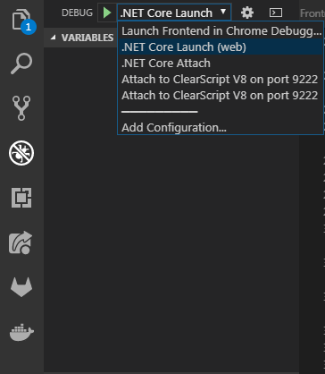

# How to Develop?

When writing code we try to write it in a clean way:
 * variables, fields, classes, methods and attributes have meaningful names -> no comments needed
 * a class, method, ... has only one purpose -> single responsibility
    * if you need to scroll to see all of your method it is probably to long
    * classes over 300 lines are maybe doing more than only one thing
    * don't use partial classes in C#

## Literature:
 * Clean Code - https://www.investigatii.md/uploads/resurse/Clean_Code.pdf

# Setup your machine - Install needed tools

## Visual Studio Code
This is the main IDE and can be used for Backend and Frontend Development.

When you first open the directory of the project you will be prompted to install the recommended Workspace plugins. Do this for the best experience.

https://code.visualstudio.com/download

## (ASP).Net Core 2.2 SDK
To build the Backend code you need the .Net Core 2.2 development kit.

https://www.microsoft.com/net/download

## NPM / Node.js
To build the frontend code NPM is needed so you have to install node.js

https://nodejs.org/en/download/

## MongoDB
Since we want to store data - a database server is needed.

https://www.mongodb.com/download-center/community

## [optional] Sourcetree, TortoiseGit, GitBash
I like to use Sourcetree for doing the branch switching and starting the merge diff on merge conflicts.
As MergeDiff I like to use TortoiseGit which also comes quit handy when using the explorer and want to query git stuff.
The GitBash is used everytime when I do more advanced git stuff or for all terminal actions (non git related).

for just committing and pushing in this project I use Visual Studio Code directly.

 * https://git-scm.com/downloads <- mandatory
 * https://www.sourcetreeapp.com/
 * https://tortoisegit.org/download/

## [optional] RabbitMQ
In the future for Message Queues to map Websockets to multiple backend instances we need RabbitMQ.

https://www.rabbitmq.com/download.html

# Workflow

 1. open an issue with the topic you want to address.
 2. in the issue click "open merge request", this creates a branch on which you can work
 3. checkout the correct branch locally and work there; push regularly to check if everything builds
 4. when done, remove the WIP prefix on the merge request and tell me to merge it after a review; Merges are only done if CI is green!
 5. merge request will be merged to master

# Run Application

To run the Backend or Frontend open Visual Studio Code, on the left menubar click on the debug icon.
Then you will see a dropdown at the top like on the following screenshot.

To prepare the the nodeJS runtime you have to run `npm install` in the Frontend directory.
To Start the Frontend select "Launch Frontend in Chrome Debugger" and click 'play' or press 'F5'.
 NPM should build the frontend in the background an launch a webserver via webpack with hot-reload enabled. So when you change a file it immediately should change in the browser which should also have opened.

To Start the Backend select ".NET Core Launch (web)" and click 'play' or press 'F5'.
