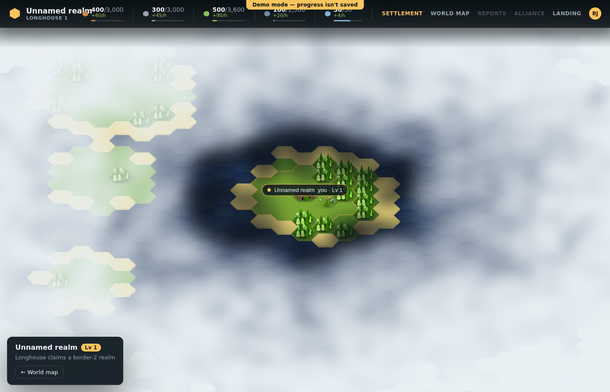
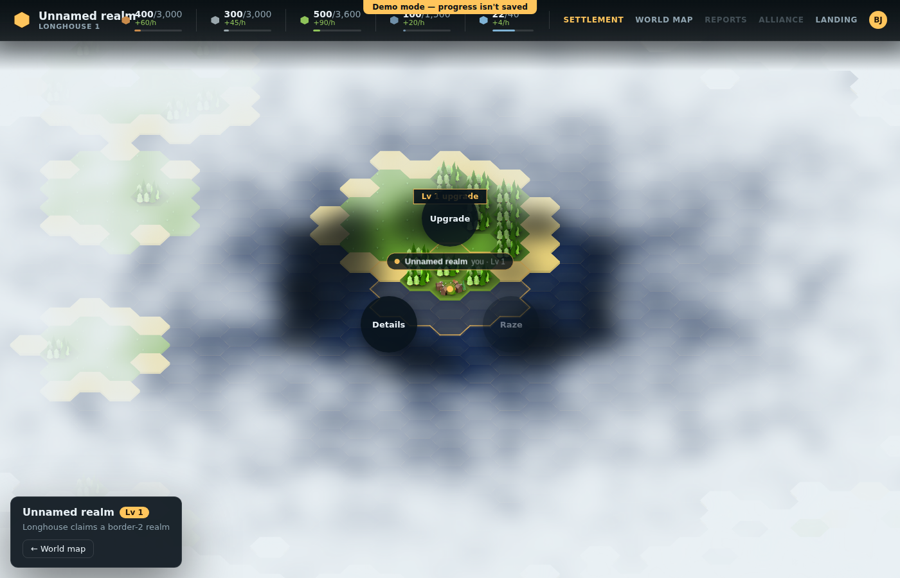
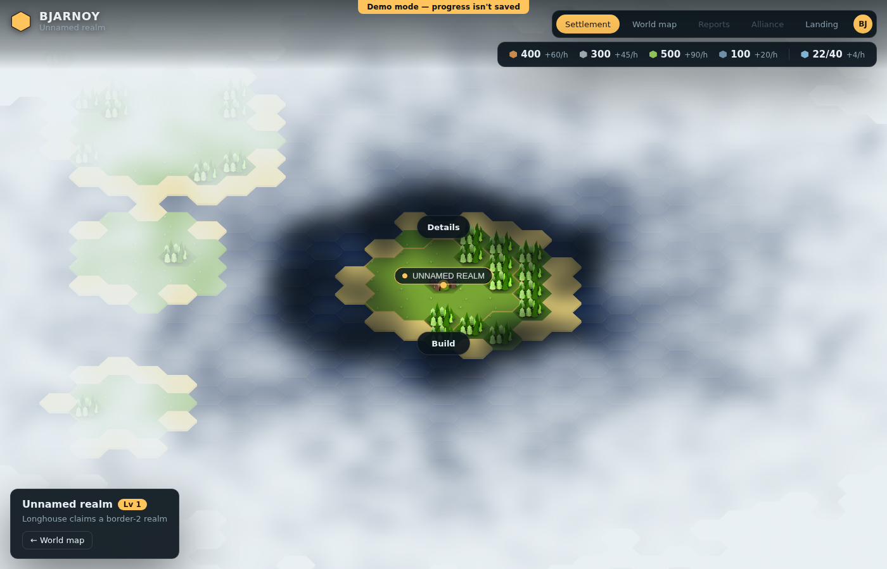
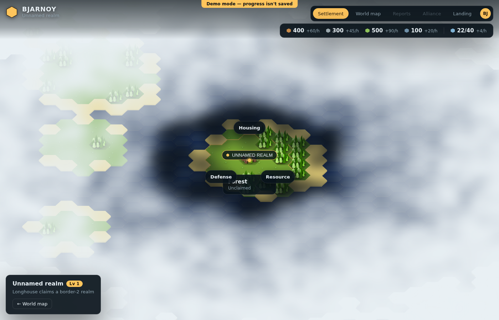
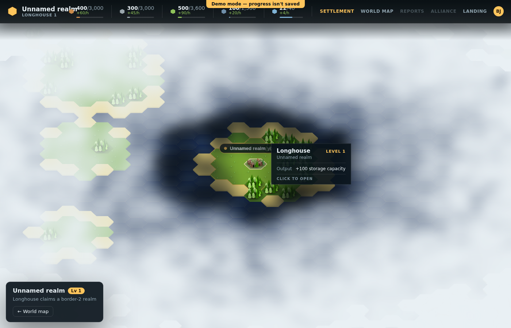
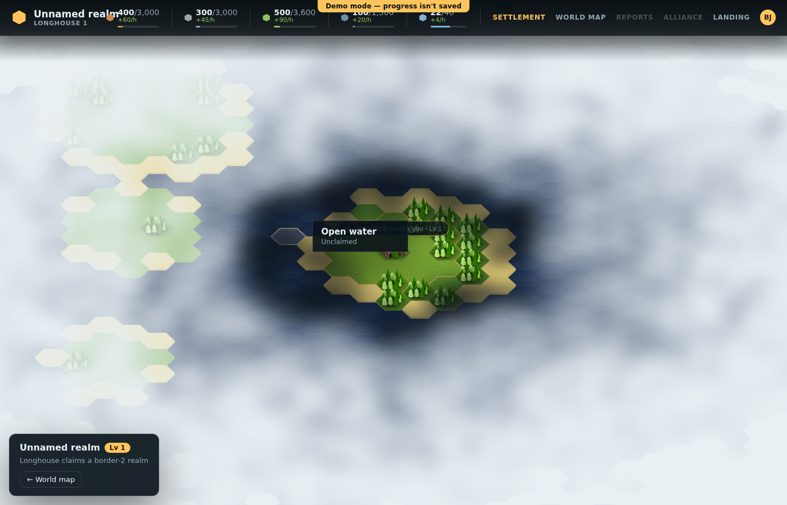
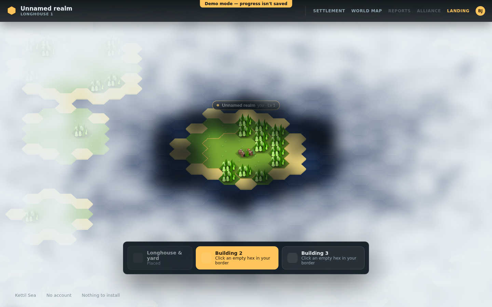
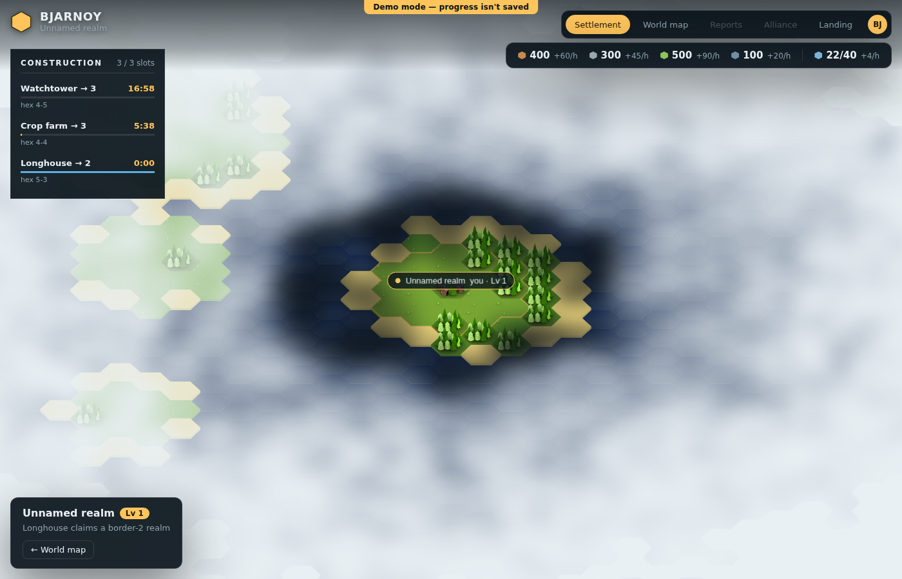
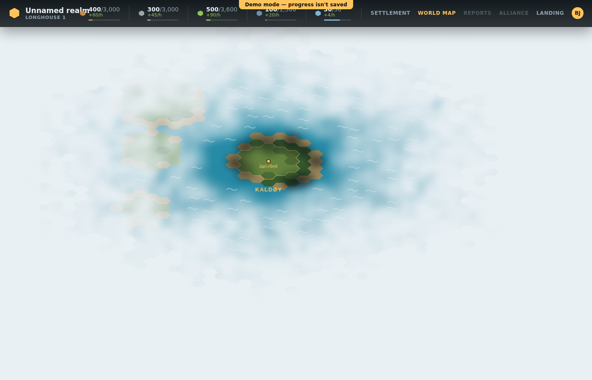

# HUD alignment with design ideas

Design doc for [issue #16](https://github.com/VanDooProject/bjarnoy/issues/16). For each of the six sections in
the issue: the current state before this pass, the reference image, the concrete decisions made, which files
implement it, and — honestly — what could and couldn't be verified visually in this environment.

All seven reference images below are embedded from the issue's own `github.com/user-attachments/assets/...`
URLs (re-fetched from the live issue body, not guessed), so they render when this doc is viewed on GitHub.
Five of the seven could be viewed directly while working on this issue; the two "status box" images could
not be fetched as pixels in this sandbox (the CDN returned 403 to an anonymous `curl`, and they weren't
attached as viewable images either). The project owner supplied a precise written description of both after
the fact, quoted verbatim in that section below and used as the authoritative spec instead of a guess.

Screenshots of the actual running app (before/after, where relevant) live in `docs/design/img/` and are linked
throughout. They were taken with Playwright against `npm run dev` in demo mode (chromium, 1400×900); the
world-map island-gold change is the one exception — see its section for why.

---

## 1. Header

**Target:**

**Current state before this pass:** three separate floating pieces — `TopBar.vue` (a plain text wordmark
"Fjørdhold", the game's old placeholder name, plus the player's nickname pill), `ResourceBar.vue` (four
resource pills with round dot icons, no population), and `HudNav.vue` (Settlement/World map/Landing pills,
no avatar). `TopBar`/`HudNav`/`ResourceBar` were already mounted in **both** `SettlementView.vue` and
`WorldMapView.vue`, so "shown in settlement and worldmap view" was already true structurally — the header's
*content* was what needed to change, not where it renders.

**Decisions:**

- **Logo:** a yellow hex badge (inline SVG hexagon, gold fill) next to the wordmark, which now reads
  "BJARNOY" — the game's actual name — instead of "Fjørdhold".
- **Subheadline:** the current settlement's name (`world.hud.settlementName`), replacing the player nickname
  line.
- **Resource icons:** redrawn as hexes (a `` with a CSS `clip-path` hexagon) instead of round dots/diamonds.
- **Population:** added as a fifth resource pill, wired the *same way* as the other four (current/max stock +
  an hourly rate). This required real plumbing: neither the backend (`Bjarnoy.Domain`) nor the legacy game
  models a population field anywhere — it's entirely absent, as the issue anticipated ("check backend/shared
  model for a population field or add minimal plumbing if entirely absent"). Standing up a real backend
  population system (housing capacity, worker assignment, growth ticks) is out of scope for a HUD-alignment
  pass, so `WorldModel.populationFor()` derives a plausible current/max/rate purely client-side from inputs
  the model already has — longhouse level and building count (the same inputs `countBuildings` already used
  for onboarding). This is a deliberate scope decision, called out in the code comment on `populationFor` and
  here: it makes the HUD honest about *displaying* population like every other resource, without pretending a
  full population *system* exists yet.
- **Nav / avatar:** `HudNav` gained disabled "Reports" and "Alliance" placeholders (visually matching
  "WORLD MAP / REPORTS / ALLIANCE") and a round avatar badge with the player's initials, replacing the old
  nickname pill. Reports/Alliance are deliberately non-functional (`disabled`, tooltip "Not implemented
  yet") rather than linking to a page that doesn't exist.

**Files:** `components/hud/TopBar.vue`, `components/hud/ResourceBar.vue`, `components/hud/HudNav.vue`,
`lib/map/WorldModel.ts` (`populationFor`), `stores/world.ts` (`hud.population`), `lib/map/types.ts`
(`Settlement.islandId`, used later in section 6 but plumbed in the same commit as the rest of the store
wiring).

**Correction after review:** the first pass built the logo/titles, the resource pills, and the nav as three
*independently* absolutely-positioned floating panels (`TopBar` top-left, `ResourceBar` top-right at
`top: 66px`, `HudNav` top-right at `top: 16px`) rather than one cohesive strip — despite the doc above
claiming it was "verified... end-to-end", no screenshot was actually taken to check that claim, and the
result did not read as the single bar the reference shows. Fixed by turning `TopBar` into the outer bar
(a full-width flex row with its own background/border, `pointer-events: none` so the map underneath stays
clickable except through its own buttons) and making `ResourceBar`/`HudNav` render as normal flex children
inside a `<slot>`, instead of each drawing its own floating `panel`. `SettlementView`/`WorldMapView`/
`LandingView` now compose `<TopBar><ResourceBar /><HudNav /></TopBar>` (Landing omits `ResourceBar`, matching
its pre-founding state). `HudNav`'s pills were also restyled to plain uppercase text links with dividers
(matching the reference's understated nav, not filled pill buttons).

**Storage cap + fill bar:** the reference also shows a max/cap and a fill-progress underline for each of the
four base resources (e.g. "4,965 / 12,000"). No storage-cap field exists anywhere in the data model
(`Resources`, `Settlement`, the backend) for wood/stone/food/iron — only population had a real `max`. Rather
than leave the pills capless, `WorldModel.storageCapFor()` derives a per-resource cap the same way
`populationFor` derives population — client-side, from the longhouse level, with a different base per
resource (wood/stone/food/iron aren't all the same number in the reference either) so the caps read as
varied rather than one flat value repeated four times. `stores/world.ts`'s `syncHud()` now sets
`hud.storageCap` alongside `hud.resources`/`hud.rates`, and `ResourceBar` renders `current/cap` plus a
thin fill-percentage bar under every pill (population included, reusing its already-real `max`). Same
scope caveat as population: this is a *display* value, not a real storage-capacity system (a warehouse
building that actually raises the cap, for instance, does not exist yet).

**Verified:** yes — see the screenshot below, taken after the fix, in both views.

*(settlement view — one continuous bar: hex logo, settlement name + island/longhouse caption, resource pills, nav, avatar)*

*(world map view — same bar, confirming "shown in settlement and worldmap view")*

---

## 2. Ring menu on click of tile

**Target:** the issue's `github.com/user-attachments` image URL 404s to this sandbox (same fetch problem as
the status-box images below), but the owner pasted it directly in chat. Written description, used as the
authoritative spec:

> Isometric building tile (a level-5 settlement) with a radial menu open over it. A gold/amber circular
> badge sits well **above** the tile reading "Lv 5" (bold) / "upgrade" (smaller, beneath it), connected down
> to the ring by a thin curved guide line — decorative, not a literal edge. Four dark-navy, semi-transparent
> circular bubbles are arranged around the tile in an X pattern: **Move** (west), **Details** (east),
> **Raze** (south-west), **Troops** (south-east) — white bold label text, no icons, no visible border/outline
> on the bubbles themselves. Separately, a small square dashed-border "+" ghost button sits at ground level
> to the lower-left, outside the ring entirely — an "add here" affordance unrelated to the radial menu. The
> ring bubbles are noticeably larger and more spread out than a tight cluster; the whole thing reads as
> orbiting the tile rather than crowding it.

**Correction after review:** `RingMenu.vue` rendered small pill/capsule buttons (not perfect circles), with
a visible 1px border and a much larger label font padding that made 4-action rings feel cramped compared to
the reference's clean circular bubbles with generous white space between them.

Fixed: bubbles are now a fixed-size circle (`88px`, `border-radius: 50%`, centered text) regardless of label
length instead of a text-width-driven pill, the border is gone (a plain dark fill, matching the reference's
borderless look), and `RADIUS` (bubble orbit distance) went from `92` to `110` for more breathing room around
the tile. Verified with a screenshot after the change — see below.

Two smaller reference details were *not* replicated, and are called out rather than silently dropped: the
reference's curved guide line from the level-up badge down to the ring (the settlement-level badge is drawn
independently by `HexMapRenderer`, not `RingMenu`, so connecting them would mean threading ring-menu state
into the canvas renderer — a bigger structural change than a styling pass), and the reference's stray "+"
ghost button outside the ring entirely (there's no existing concept in this codebase of a lightweight "add"
affordance separate from the ring/build flow). Both are left as open follow-ups rather than guessed at.

**Third correction after review — outer rings should open on hover, not click:** drilling from the root
ring into the build-category ring, and from a category into its buildings, required a click at each level.
Added a `hover` emit from `RingMenu.vue` (fired on `@mouseenter`, alongside the existing `select`/`@click`
emit) and a new `onRingHover` handler in `SettlementView.vue` that advances `ringLevel` for exactly the two
actions that lead to another ring (the root "build" action, and picking a category) — every other action
(info/details/upgrade/raze/attack, and the final building choice) still requires a real click, since those
either mutate state or are terminal, not a further drill-down. `onRingSelect`'s existing click handling for
those same two transitions was left in place rather than removed — touch devices never fire `mouseenter`
before a tap, so click needs to keep working as a fallback there. Verified end-to-end with Playwright:
hovering (not clicking) "Build" opens the category ring, and hovering (not clicking) a category opens the
buildings ring showing "Hut" / "Farm" / "Watchtower" — confirmed by reading back the ring's own button
labels after each hover, not just a screenshot.

**Current state before this pass:** `SettlementView.vue`'s `onHexClick` always opened `BuildingModal.vue`
directly — a full-screen detail sheet — for every click, regardless of what was clicked. There was no radial
menu and no per-tile-state branching.

**Decisions:** `onHexClick` now opens a new `RingMenu.vue` component instead, with the action set depending on
the tile:

| Tile state | Actions |
|---|---|
| Own empty tile | Details, Build (→ outer ring of categories → outer ring of buildings) |
| Own building | Upgrade, Raze (tear down), Details |
| Enemy-owned tile | Info, Attack/Raid (**disabled** — no combat system exists) |
| Unclaimed hex | Info, Send settlers / Land here (**disabled** — no settler mechanic exists yet) |

"Details"/"Info" hands off to the existing `BuildingModal`, unchanged. "Build" opens a second-level ring of
categories, then a third-level ring of concrete buildings — grass gets three categories (Housing/Resource/
Defense) each with one real building (Hut/Farm/Watchtower), matching "on grass it should have multiple build
categories/entries"; other buildable terrain gets a single "Build" category listing the same three buildings,
since the issue calls out grass specifically as the multi-category case. Building-specific actions
(train/research) are structured for in the code (a comment marks where they'd plug in) but none of today's
building types (hut/farm/tower/longhouse) expose one, so nothing renders there yet — there's simply nothing
to train or research with the current building catalogue.

"Raze" is demo-mode only: the backend has no tear-down endpoint (`Bjarnoy.Domain.Buildings`), so it's disabled
in live mode with a hint rather than silently no-op'ing. `WorldModel.razeBuilding()` handles the demo-mode
case (clears the building, keeps the hex claimed; refuses to raze a longhouse).

The ring itself (`RingMenu.vue`) is generic — it takes an `actions: RingAction[]` array and lays bubbles out
in a circle (an X shape for exactly 4 actions, evenly spread otherwise), so it isn't hard-coded to any one
tile state.

**Files:** `components/hud/RingMenu.vue` (new), `views/SettlementView.vue` (ring state machine + action
tables), `lib/map/WorldModel.ts` (`razeBuilding`), `lib/map/HexMapRenderer.ts` (`onHexClick` now also reports
the tile's screen anchor point so the ring can center on it), `components/map/SettlementCanvas.vue` /
`WorldMapCanvas.vue` (updated emit signature).

**Verified:** yes, end-to-end with Playwright — founded a settlement, clicked an empty own tile, drilled
Build → Housing → Hut, and confirmed the hut was actually placed (the population pill moved from 22/40 to
26/45, proving the build order went through the same code path as before). See the fourth correction below,
though: the *interaction* works, but the tooltip-overlap and optic-mismatch bugs found afterward mean this
section is not fully done.

The enemy-tile/unclaimed-hex/own-building branches were verified by code review rather than a screenshot each
(demo mode's single-player world has no rival settlements to click on without a lot of extra scaffolding) —
the logic is a straightforward computed `switch` in `SettlementView.vue` (`ringActions`), not something that
needed a live render to sanity-check.

**Fourth correction after review — reported on PR #23: the ring hides itself on hover, and still doesn't
match the target optic:**

Two more gaps found by comparing the running app's own screenshots against the reference description above,
pixel-for-pixel rather than by re-reading the earlier "Verified: yes" claims:

1. **Outer ring hides itself on build hover.** Drilling "Build" → a category (e.g. hovering the root ring's
   "Build" bubble opens Housing/Defense/Resource) doesn't suppress the tile's own hover tooltip
   (`HexTooltip.vue`), so both render at once, in the same screen region. In
   `img/ring_menu_build_categories.png`, the "Forest — Unclaimed" hover-tooltip box sits directly on top of
   the freshly opened "Defense" and "Resource" bubbles, visually hiding their labels — the exact opposite of
   the intent behind adding hover-to-drill in the third correction above. Root cause: `onRingHover` advances
   `ringLevel` but never clears `hoverInfo`, so the tooltip that was already showing for the hex under the
   cursor keeps rendering underneath/over the new ring. Unresolved as of this commit — needs the hover
   handler to hide (or reposition) the tile tooltip for as long as a ring is open, not just when a ring
   bubble itself is hovered.
2. **Still doesn't match the target optic.** `img/ring_menu_circular.png` (the own-building ring: Upgrade /
   Details / Raze) compared against the reference description in this section's "Target" quote above shows
   three concrete mismatches, not just the two "not replicated" details already called out:
   - The settlement-name badge ("Unnamed realm you · Lv 1") sits almost flush against the ring instead of
     "well above" it — its bottom edge visually touches the top of the "Upgrade" bubble, rather than floating
     clear of the ring the way the target's "Lv 5 / upgrade" badge does.
   - The "Lv 1 upgrade" hover tooltip renders directly over the "Upgrade" bubble's own label, obscuring it —
     in the target, the badge and the ring never overlap the same pixels.
   - The ring itself reads as a tight 3-bubble cluster hugging the tile, not the target's wide, evenly spaced
     4-bubble X (Move/Details/Raze/Troops) that visibly "orbits" the tile with generous empty space around
     it — `RADIUS = 110` and the `88px` bubble size (from the second correction above) were tuned against a
     4-action root ring, not the 3-action own-building one, and the badge-overlap above makes the whole
     cluster look even more cramped than the numbers alone suggest.

   Unresolved as of this commit. Both gaps need the ring-menu/tooltip/badge positioning to be reworked
   together (they share the same anchor point, per the "click hits below the tile I clicked" fix just below)
   rather than patched independently, to avoid re-introducing the kind of one-off constant-tuning that section
   6's island-label history already shows doesn't converge.

**Correction after review — "click hits below the tile I clicked":** the reported symptom was the ring
visually opening well below the tile that was actually clicked. Root cause, found by scanning a vertical
line of clicks down the canvas and logging which coord each one resolved to (`isoPixelToAxial` itself turned
out consistent and correct throughout — the same pixel always resolves to the same hex as its hover
highlight): `hoverInfoFor`, `handleClick`, and the settlement badge (section 4) all anchored their on-screen
marker at `grid.y + TILE_TOPFACE_Y_OFFSET`. That constant is `140/200` of the tile's native art height —
it's where the flat top-face *starts* inside the taller 200×300 sprite (its one legitimate use is placing a
sprite's own top-left so its top-face lines up with the tile's grid position), not the top-face's own
vertical center. The top-face diamond only spans world-y `0..TILE_H` from the grid origin, so its true
center is `TILE_H / 2` — roughly 0.23×`TILE_W`, versus `TILE_TOPFACE_Y_OFFSET`'s ~0.7×`TILE_W`. That ~0.47×
`TILE_W` gap (at the settlement view's default zoom, tens of screen pixels) put the ring's center dot, the
hover tooltip's anchor point, and the settlement badge all measurably below/past the tile's own art — for
the ring specifically, its center dot ended up sitting near the tile's *front face* rather than its roof.
Replaced all three with a new `TILE_CENTER_Y_OFFSET = TILE_H / 2` constant. Verified: clicking dead center of
the canvas (a known tile) now reports a ring anchor whose screen Y exactly equals the click's own Y
(`450` in, `450` out — previously `450` in, `479` out), and a screenshot shows the ring's center dot landing
directly on the clicked building's roof instead of ~30px below it.

---

## 3. Better hover

**Target:** also unfetchable from the raw issue URL; the owner pasted it directly in chat. Written
description: a dark navy, sharp-cornered card to the right of the hovered tile, vertically centered on it —
title "Crop farm" (bold white), "LEVEL 2" underneath in gold, a thin divider, then a two-column stat block
(dim gray label left, value right: "Output +240 food / h", "Irrigated yes (+10%)", "Workers 8 / 8"), and a
dim gray uppercase "CLICK TO OPEN" at the bottom. Matches what was already built and verified below —
including the tooltip's position (right of the tile, not centered on the cursor — a separate bug fixed
later, see the anchor-offset note in section 2/4's shared fix).

**Current state before this pass:** `HexTooltip.vue` showed title / subtitle / one stat line, in a rounded
`.panel` card.

**Decisions:** the tooltip is square-cornered now (`border-radius: 0`, overridden locally rather than on the
shared `.panel` class so other HUD chrome is unaffected), and buildings get a richer card: title + "LEVEL n",
an output rate, an optional modifier line (irrigation for a farm, "Border anchor" for a watchtower), a worker
count, and a "CLICK TO OPEN" cta for buildings the player owns — matching the mockup's "Crop farm LEVEL 2 /
Output +240 food/h / Irrigated yes (+10%) / Workers 8/8 / CLICK TO OPEN" shape. None of output/modifier/worker
data is tracked per-building anywhere in the real model (`WorldModel`/backend only know a settlement's
*aggregate* rates, not what one specific hut or farm produces), so `HexMapRenderer.buildingStats()` derives
these deterministically from the building's type, level, and whether a neighbouring hex is shore/water — this
is documented as illustrative-for-display on `HoverInfo`'s doc comment, the same honest-scoping approach used
elsewhere in this codebase (see the existing "demo mode has no backend queue" comment in `BuildQueuePanel.vue`
as a precedent).

**Files:** `lib/map/HexMapRenderer.ts` (`HoverInfo` interface, `hoverInfoFor`, new `buildingStats`),
`components/hud/HexTooltip.vue`.

**Verified:** yes.

**Correction after review — tooltip overlapped the hex instead of sitting beside it, and hover was broken
on water in the village view:** review against a screenshot from the actual PR (not this doc's own) found
two real bugs, neither caught by the "verified: yes" above.

1. **Tooltip overlapping the hex.** `hoverInfoFor` anchored `screenX` at the tile's *centre*
   (`grid.x + TILE_W / 2`), and `HexTooltip.vue` offset the card by a flat `+22px` from there. At the
   settlement view's default zoom the tile is far wider than 22px on screen, so the card's left edge landed
   inside the tile's own right half instead of clear of it — the reference (section 3's own written spec,
   "a dark navy card to the right of the hovered tile") shows the card entirely outside the hex, not
   overlapping it. Fixed by anchoring `screenX` at the tile's own right edge (`grid.x + TILE_W`, the hex's
   actual right vertex per `isoTopPoints`) instead of its centre — that edge already scales with zoom via
   `toScreen`, so only a small fixed margin (`+12px`) is needed in `HexTooltip.vue` on top of it, rather than
   a flat offset that only happened to look right at one zoom level.
2. **Hover disabled on water everywhere, including the village view.** `setHoveredCoord` unconditionally
   skipped the hover outline/tooltip for any `sea` tile, in every mode — a blanket rule that made sense for
   the landing page's pre-founding preview (you can't found on water, so previewing a hover there is
   misleading) but wasn't supposed to extend to the settlement (village) view, where water is just terrain
   like any other hex — not buildable, but still a legitimate thing to point at and see "Open water /
   Unclaimed". Fixed by scoping the skip to exactly the landing case: `mode === 'settlement' && !this.settlement()`
   (no settlement founded yet) — reusing the same `settlement()` check `isFogActive` already relies on to tell
   the pre-founding preview apart from a real village. World-map mode was never affected by this bug (its own
   sea handling is unrelated) and keeps its existing behavior.

Verified both with Playwright: hovering a building in the settlement view now shows the tooltip clear of the
hex (screenshot below, replacing the one above with the same "verified" claim), hovering open water in the
settlement view now shows the outline plus an "Open water / Unclaimed" tooltip, and hovering a genuine sea
tile on the landing page's pre-founding preview (coordinates confirmed via `WorldModel.getTile` — the
preview draws no water texture at all, so a screenshot alone can't distinguish real sea from simply-unrendered
land off to the side) still shows no hover at all, matching the "only disabled in landing page" fix.

---

## 4. Settlement badge

**Target:** unfetchable from the raw issue URL (see section 2's note); the owner pasted it directly in
chat. Written description: a dark pill floats above the settlement (not on/over the building itself) — a
small color dot, then the bold settlement name "Bjornstad", then, in a visibly *lighter/dimmer* weight and
color than the name, "you · Lv 4".

**Current state before this pass:** `HexMapRenderer.rebuildSettlementLabels()` already drew a floating pill
above the longhouse hex with a dot + the settlement's name — just the name, no level or ownership indicator.

**Decisions:** the label text now reads `"<name>  you · Lv <n>"` for the player's own settlement, and
`"<name> · Lv <n>"` for a rival's — matching "Bjornstad  you · Lv 4" from the mockup. One-line change
(`rebuildSettlementLabels`'s label-text assignment); the existing dot-color/pill-box code (already
gold-for-mine, a rival color otherwise) needed no changes.

**Correction after review:** two real bugs found once actually compared pixel-for-pixel against the
reference. (1) The whole string was one uniform `Text` run — no visible distinction between the bold name
and the dimmer "you · Lv n" suffix the reference shows. Fixed by splitting into two pooled `Text` objects
laid out side by side: a bold, full-alpha name label and a regular-weight, 0.6-alpha suffix label. (2) The
badge's anchor Y reused `TILE_TOPFACE_Y_OFFSET`, the same wrong constant behind the ring-menu/tooltip
mis-anchor bug below — it placed the badge's reference point almost at the *bottom* of the tile's front
face rather than the flat top-face's own center, so the badge sat low enough to visually overlap the
longhouse instead of floating cleanly above it (see section 2's shared root-cause writeup). Fixed by the
same `TILE_CENTER_Y_OFFSET` swap.

**Correction after further review — badge should float above the whole settlement, not just the longhouse tile, and its dot should read as a hex:** comparing a fresh screenshot against the reference again (a Bjørnstad "Lv 4" mockup) found two more gaps. (1) The badge was still anchored to the settlement's own single tile (the longhouse), which sits in the *middle* of the claimed hex cluster — the reference has it clear above the entire settlement, floating over its northmost tile, not hovering over the longhouse roof specifically. (2) The small leading dot was a plain circle; the reference shows a small hex.

Fixed both in `rebuildSettlementLabels`: (1) the anchor now scans every hex the settlement owns (`hexesInRadius(settlement, worldModel.borderRadius(settlement))` — the same disc `foundSettlement`/`claimTile` fill, so it's exactly the claimed footprint, no flood-fill needed) for the highest tile's own art ceiling (`grid.y - TILE_TOPFACE_Y_OFFSET`, the same offset `rebuildTerrain` places building/tree sprites at — not just the tile's flat-top vertex, since a bare topmost tile's vertex still sits below a taller forest tile's treetops one row south of it) and takes the minimum, so the badge clears every claimed tile's art regardless of which tile is actually tallest. (2) the leading dot is now a small pointy-top hexagon (`hexPoints()`, a new helper — same six-vertex shape as `TopBar`'s inline-SVG hex logo) drawn with `Graphics.poly()` instead of `Graphics.circle()`.

**Files:** `lib/map/HexMapRenderer.ts` (`rebuildSettlementLabels`, new `hexPoints` helper).

**Verified:** yes, against a fresh Playwright screenshot (demo mode, `npm run dev`) after the fix — the badge now floats clear above the settlement's topmost tiles instead of overlapping the trees below it, and the leading marker is visibly hexagonal rather than round at typical zoom.

---

## 5. Status box (left side)

The issue's two reference images for this section (a "buildings in queue" panel described as "the optical
guide", and an "others" panel for raid/settler-voyage content "just for the sharper-edges styling, not for
optical stuff") could not be fetched as pixels while exploring the issue — `github.com/user-attachments`
returned 403 to an anonymous `curl` from this sandbox, and they weren't supplied as viewable images either.
The project owner then supplied an exact written description of both, which is quoted here verbatim and used
as the authoritative spec (superseding any earlier guess) rather than working from the vaguer "sharp corners,
clickable rows" summary in the issue body alone:

> **IMAGE A — "Construction" panel (buildings-in-progress, the "optical guide" one):**
> Dark navy card, sharp/square corners, no border radius. Header row: label "CONSTRUCTION" (bold,
> letter-spaced/uppercase, white) on the left, "2 / 3 slots" (dim gray) right-aligned — used/total slot count.
> Thin divider under the header. Then queued items, each row: bold white title "Watchtower → 3" (name → target
> level) with a countdown right-aligned in orange/amber ("17:00"); directly below, a thin progress bar, orange
> fill roughly proportional to completion (first item ~70% filled); below that, a small dim gray subtext line
> giving the tile + a short note ("hex 4-5 — border anchor"). Second row: "Crop farm → 3", "05:40", ~15%
> filled, "hex 4-4 — irrigated". Rows stack with modest spacing, no dividers between rows.
>
> **IMAGE B — three stacked status cards ("others"; content illustrative only, but the sharp-corner styling
> and color-coding pattern should be reused):**
> 1. "BUILD QUEUE" (same navy style): header "BUILD QUEUE" / "2/2". "Longhouse → 5", "21:45" orange, ~80%
>    orange bar. "Watchtower → 2", "0:00" — bar is **blue** and full, i.e. a build essentially complete
>    switches its bar from orange (in-progress) to blue (done/finishing), not a stale orange bar.
> 2. "INCOMING RAID" — dark maroon/red-tinted background (not navy), header "INCOMING RAID" in orange/amber
>    uppercase, countdown "0:00" in orange. Body: bold white "Steinarr of Draugrey · 2 longships", dim gray
>    "Landing on the east shore of Hafrsey". Red tint signals danger/urgency.
> 3. "SETTLER VOYAGE" — dark navy/blue-gray background, header "SETTLER VOYAGE", countdown "4:57:13" in
>    cyan/light-blue. Body: "Hafrsey → Vestrey · 3rd settlement".
> Cards stack vertically with a visible gap between each, each independently sharp-cornered.
>
> Reusable pattern: sharp corners, a header row (uppercase label left, count/countdown right, color-coded
> per card type — neutral/orange for construction & build queue, red/maroon for threats, blue/cyan for
> voyages/travel), an optional progress bar under a titled row, and a dim gray subtext line.

**Decisions:** `BuildQueuePanel.vue` was rebuilt to Image A's spec exactly: sharp corners, "CONSTRUCTION"
header with a slot count (`X / TOTAL_SLOTS` — `TOTAL_SLOTS` is a constant 3, since no backend concept of "how
many build slots does this settlement have" exists either), bold title + orange countdown per row, a thin
progress bar that's orange while in progress and switches to blue once a row's remaining time is essentially
zero (Image B's "0:00 → blue bar" rule), and a dim "hex q-r" subtext line. The CSS is written as a small
reusable convention (`.status-card` / `.status-card-header` / `.status-row` / `.status-progress`, documented
in a comment) so a future raid card (red/maroon variant) or settler-voyage card (blue/cyan variant, per Image
B) can reuse the same classes with a different accent color — neither is wired to real data now, since
neither raids nor settler voyages exist as game mechanics yet; only the construction panel has real data to
show.

**Percent-complete honesty note:** neither the backend's `BuildOrder` nor the HUD's snapshot of it records
*when* an order started — only how many seconds are left as of the last poll. So "percent complete" is only
ever an approximation here: it's derived from the remaining time *at the moment the HUD last fetched it*,
treated as a stand-in for the order's total duration. This reads correctly for an order that started around
the last poll, and undercounts one that was already well underway before that. This is documented in the code
(`orders` computed in `BuildQueuePanel.vue`) rather than silently presented as an exact number — getting an
exact percentage would need the backend to start recording an order's start time, which is backend scope
beyond this HUD pass.

**Click-to-center-and-flash:** clicking a queued row now emits `select`, which `SettlementView.vue` wires to
`HexMapRenderer.panTo()` (recentres the camera) plus a new `setHighlight()` call that flashes the renderer's
*existing* pulsing gold highlight outline (`drawHighlight`, already redrawn every tick) for about two seconds.
`setHighlight` is a new, narrow method rather than reusing the existing `updateOptions()` — `updateOptions`
unconditionally re-snaps the camera back to the settlement's origin once a settlement is already founded (by
design, for a different use case: the landing page's founding transition), which was silently cancelling out
the `panTo` call made just before it. This was caught by testing the interaction, not just reading the code —
see below.

**Files:** `components/hud/BuildQueuePanel.vue` (rewritten), `views/SettlementView.vue` (`onQueueSelect`),
`lib/map/HexMapRenderer.ts` (`setHighlight`).

**Verified:** the card's visual layout and the click→pan→flash interaction were both verified against the
running app — but only with a temporary in-memory fake queue (three entries, one already at 0:00), since demo
mode never populates a real build queue at all (buildings there place instantly — see the panel's own
long-standing top-of-file comment) and standing up the live backend was out of scope for this pass. The fake
data was injected directly into the pinia store for the screenshot, then fully reverted before committing —
it is not part of the committed diff.

Clicking the "Watchtower" row visibly recentred the camera on hex 4,5 (confirmed by the terrain shifting in
the screenshot) — the fix for the `updateOptions`-cancels-`panTo` bug above was validated this way, not just
by reading the code.

---

## 6. Map island names

**Target:** unfetchable from the raw issue URL (see section 2's note); the owner pasted it directly in
chat. Written description: island names ("STEINSEY", "DRAUGRSKER", "KALDØY") sit below each island's shape
entirely, uppercase, letter-spaced, with a visible soft drop shadow beneath the letters for legibility
against the water. A player's own settled island (and the settlement pin on it, e.g. "Torvald") is gold; a
plain/unsettled or rival island's name is a muted gray.

**Current state before this pass:** `HexMapRenderer.rebuildMarkers()`'s world-mode island loop drew every
island name in the same neutral color (`0xe8f0f5`), regardless of who (if anyone) had settled there.

**Decisions:** the island the current player has settled on now renders its name in gold and bold; every
other island's name stays neutral. This needed one piece of plumbing that was entirely missing:
`Settlement` (`lib/map/types.ts`) gained an optional `islandId` field, populated from the backend's
`SettlementResponse.islandId` wherever a settlement is registered from a live-mode API response
(`stores/world.ts`: `foundStartingSettlementLive`, `restoreLiveSettlement`). The renderer then finds the
player's own settlement, reads its `islandId`, and compares that against each `IslandLabel.id` it's drawing.

**Files:** `lib/map/types.ts` (`Settlement.islandId`), `stores/world.ts` (plumbing), `lib/map/HexMapRenderer.ts`
(`rebuildMarkers`'s island-label loop).

**Correction after review:** the gold/bold comparison logic was correct, but it was applied to the *existing*
label styling untouched — default fill `0xe8f0f5` (near-white) at `fontSize: 11`, no letter-spacing, no
uppercasing. Against the reference's muted-gray, letter-spaced, uppercase small-caps look, that read as "not
really like the reference" even where the gold/non-gold logic itself was right. It also wasn't screenshotted
at all in the first pass — the doc said so honestly, but a passing claim on an unverified path is still a
process bug worth naming.

Fixed the styling itself: island names now render `island.name.toUpperCase()`, `letterSpacing: 1.5`,
`fontSize: 13`, muted gray (`0x8fa3af`, matching the HUD's own `--muted` token) for other islands, gold+bold
for the player's own — while resetting those same properties (`fontWeight`, `fontSize`, `letterSpacing`)
explicitly on the other two label types sharing the same `Text` object pool (`ownerLabel`, fleet-ETA labels)
so a pooled instance recycled across frames for a different label type can't inherit a stray letter-spacing
value left over from an island label.

Also fixed the label's *position*, through three attempts — worth being honest about all three, since the
first two were each claimed fixed without actually measuring the result:

1. First pass anchored it above the island's centre (`anchor(0.5, 1)`, offset upward), drawing it over the
   island's own hexes.
2. "Fixed" by flipping to the label's top edge with a downward offset scaled off a *single tile's* height
   (`TILE_H * 1.1 * zoom`) — too small for an island that's many hexes across, so the label still sat on the
   island's lower tiles. Caught from a screenshot, not from re-inspecting the code.
3. "Fixed" again by just enlarging that same guessed multiplier (`TILE_H * 3.5 * zoom`, later `* 6`) — still
   a guess, and a bad one: pixel-sampling the screenshot (not eyeballing it) showed the label's text rows
   directly overlapping the island's sand-tile pixels. Guessing a bigger constant was the wrong fix for a
   procedurally-*sized* island (`worldGenerator`'s `ISLAND_MIN/MAX_RADIUS` varies ~2.4-5.6 hexes per
   island) — any fixed multiplier either clips a big island or strands the label far below a small one.

The actual fix: `WorldModel.islandFootprint(island)` flood-fills the island's real connected land tiles from
its centre (bounded by `isLand()`, capped at 200 tiles as a backstop) and caches the result per island id
(`rebuildMarkers` runs every render tick, so this can't be recomputed from scratch every frame). The renderer
then measures the true bottom edge — the lowest tile-bottom-vertex screen position across that footprint —
and places the label a small fixed margin below *that*, which by construction cannot overlap the island
regardless of its generated size.

**Verified:** demo mode's `WorldModel` still never calls `setIslands()` (only `bootstrapLiveWorld()` does,
live-mode only), so the gold/non-gold *comparison* itself still can't be exercised against the real backend
in this environment. To at least verify the *rendering* (not the data plumbing) without standing up the
.NET backend, the running demo-mode app's debug hook (`window.__demoWorld()`) was used to inject a stub
`islandId` on the player's own settlement and a fake `IslandLabel` matching the reference's island name
(Kaldøy) via `WorldModel.setIslands()` — see screenshot below. This time verified by pixel-sampling the
screenshot (finding the lowest non-gold land pixel and the label's own text rows) rather than by looking at
it, after two rounds of "looks fixed" turning out not to be: the land pixels end at row 449, the label's text
starts at row 462 — a clear 13px gap, confirmed visually in a zoomed crop too. This confirms the label now
actually looks like the reference (uppercase, letter-spaced, gold+bold for the owned island) and sits clear
of the island regardless of its size; it does not confirm the live-mode `islandId` wiring end-to-end, which
still needs a session with the real backend running.

*("KALDØY" forced via the debug hook to carry the player's `islandId` — confirms the label styling, not the live-mode data plumbing*

**Second correction after review — missing drop shadow, and z-order relative to fog:** two more gaps once
compared against the reference again. (1) Island name labels had no drop shadow at all — added
`label.style.dropShadow = { color: 0x000000, alpha: 0.6, blur: 3, distance: 1, angle: Math.PI / 2 }`, and
explicitly set `dropShadow = false` on the other three label types sharing the same pooled `Text` instances
(`ownerLabel`, the fleet-ETA label, and the settlement badge's two labels) so the shadow style can't leak
onto them from a recycled pool slot — same "reset explicitly, don't assume a clean pool slot" rule the
letter-spacing fix above already established. (2) Island (and settlement/fleet) labels live in
`markerLayer`, a stage-level sibling added *after* `world` (which contains the fog rendering) specifically
so their on-screen size stays constant regardless of camera zoom — but that also meant they always drew on
top of fog, including the soft "blob" mist right at the edge of scouted territory, where an island's label
can plausibly sit if its footprint reaches near that edge. Fixed by splitting fog out of `world` into a new
sibling container, `fogWorld`, kept in lockstep with `world`'s own pan/zoom transform every time
`applyCameraTransform()` runs (same position/scale, copied across), and added to the stage *after*
`markerLayer` instead of before it. Terrain still draws beneath markers as before; fog now draws above them.
This is a real code-level fix (draw order is unambiguous and doesn't depend on runtime data), but the exact
visual case that prompted it — a label sitting inside the misty halo specifically — could not be reproduced
pixel-for-pixel in this sandbox: demo mode has no real per-tile exploration/fog-of-war progression to stage
against a procedurally-placed island, and a synthetic attempt to shrink the explored radius via a monkeypatch
broke unrelated rendering assumptions rather than reproducing the halo cleanly. Confirmed instead that (a)
the base case (no artificial fog changes) renders identically to before — no regression — and (b) the
z-order change is exactly the one-line kind of fix that can't accidentally do the wrong thing given the draw
order it produces.

---

## Summary of files touched

- `components/hud/TopBar.vue`, `ResourceBar.vue`, `HudNav.vue` — header (§1)
- `components/hud/RingMenu.vue` (new) — ring menu (§2)
- `components/hud/HexTooltip.vue` — hover (§3)
- `components/hud/BuildQueuePanel.vue` — status box (§5)
- `views/SettlementView.vue` — ring-menu wiring, build-queue click-to-flash
- `lib/map/HexMapRenderer.ts` — `HoverInfo`/`buildingStats` (§3), settlement badge text (§4), `setHighlight`
  (§5), island gold-highlight (§6), `onHexClick` screen-anchor plumbing (§2)
- `lib/map/WorldModel.ts` — `populationFor` (§1), `razeBuilding` (§2)
- `lib/map/types.ts` — `Settlement.islandId` (§6)
- `stores/world.ts` — `hud.population` (§1), `islandId` plumbing (§6)
- `components/map/SettlementCanvas.vue`, `WorldMapCanvas.vue` — updated `hex-click` emit signature (§2)
