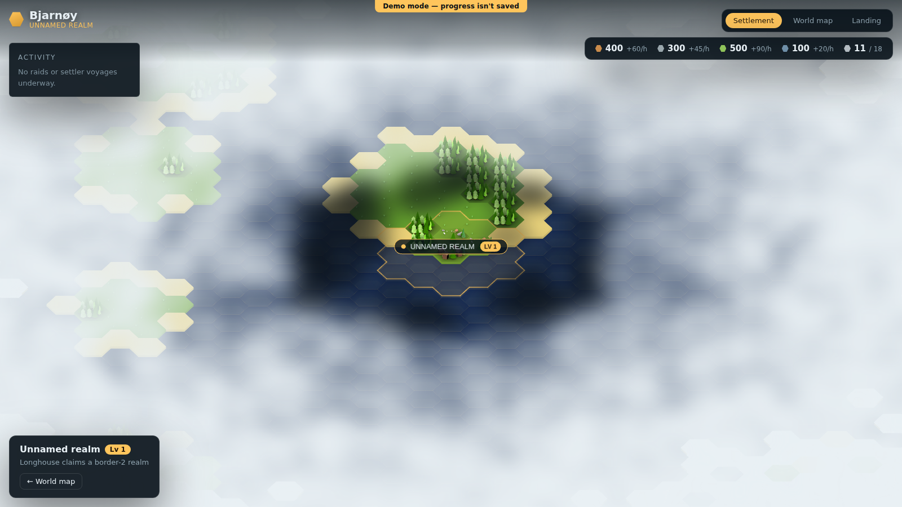
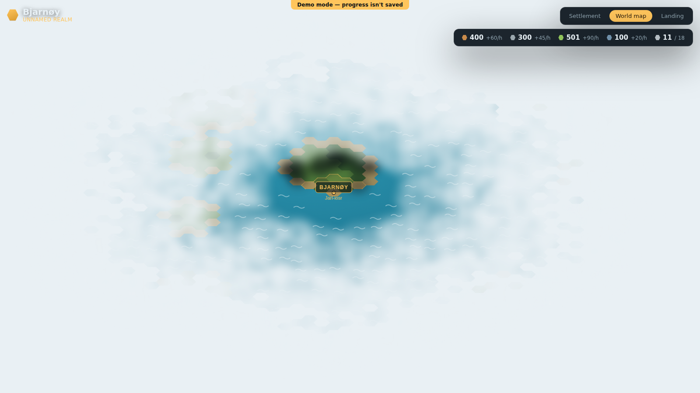
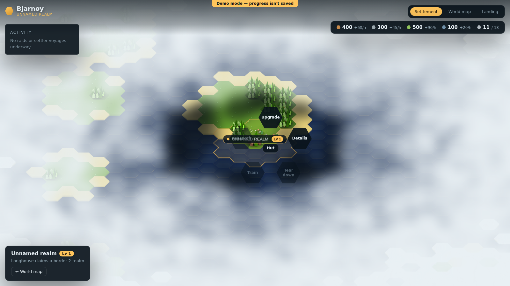
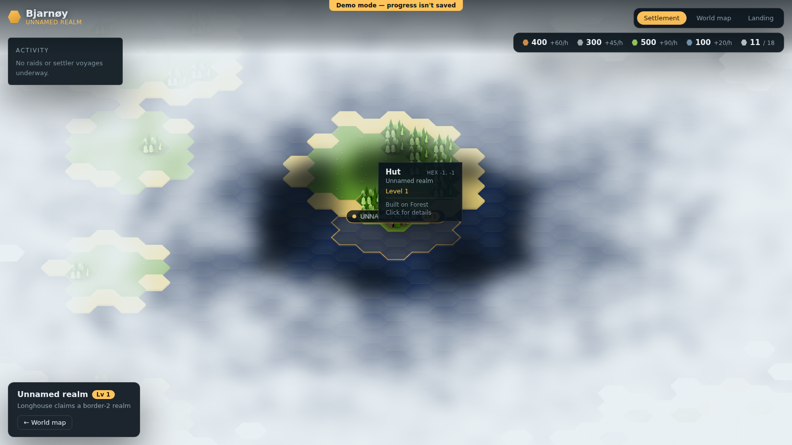
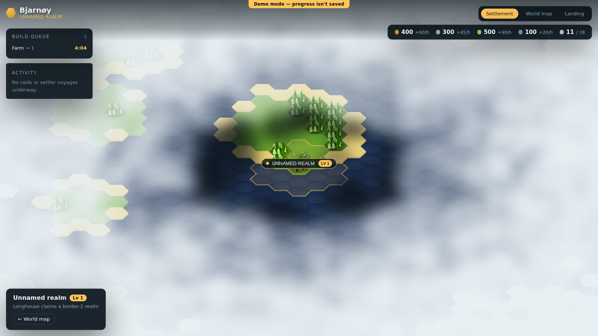
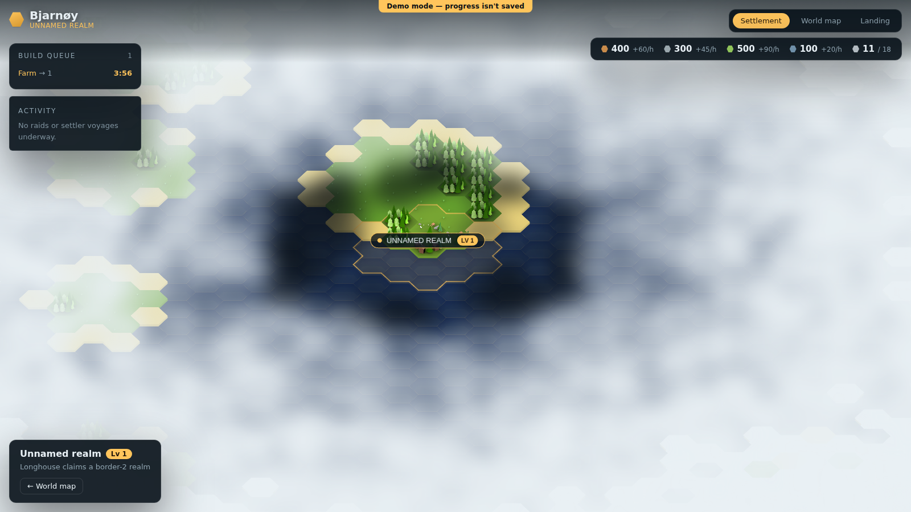

# Issue #16 — HUD alignment with design ideas

Implements [issue #16](https://github.com/VanDooProject/bjarnoy/issues/16), which asked to align
the in-game HUD with a set of design references attached directly to the issue (six sections:
header, ring menu, hover, settlement badge, status box, map island names) and to write up this
document.

> **A note on the reference screenshots.** The images in issue #16 are hosted at
> `github.com/user-attachments/...`. This session's sandboxed network proxy routes `github.com`
> through a repository-scoped API relay and can't reach that attachments host (or the CDN it
> redirects to), so the reference images could not be downloaded or embedded here — only the
> issue's own text/alt-text was available while implementing this. Each section below links
> straight to the reference image on the issue so you can compare side-by-side; the screenshots
> embedded in this doc are all "after" shots of the real running app (demo mode, local dev
> server), not recreations of the references.

Every change described below is on branch `claude/issue-16-implementation-2ts65o`, and shipped
as one commit per section so each is reviewable on its own.

---

## Header

**Reference:** [issue #16, "header"](https://github.com/VanDooProject/bjarnoy/issues/16) —
"shown in settlement and worldmap view", "the pop(ulation) thing should also be implemented like
with the other ressources", "the logo should be a yellow hex and the game is named Bjarnoy", "the
sub headline is the name of the settlement", "res icons/symbols should also be hexes".

**What changed:**
- The game's own name is now shown as **Bjarnøy** (matching the spelling already used elsewhere
  in the app, e.g. the landing page's "Empty plot · Bjarnøy") instead of the placeholder
  "Fjørdhold" — `index.html`'s title, the header wordmark, and the Impressum page.
- A small yellow hex sits next to the wordmark as the logo (`TopBar.vue`).
- The settlement's own name now shows as a subheadline under the wordmark, sourced from the same
  `world.hud.settlementName` the rest of the HUD already uses.
- The four resource pips switched from plain dots to hexes (a shared `.hex` clip-path added to
  `style.css`, since the settlement badge and world-map island labels use the same "everything is
  a hex" motif).
- A fifth pip, **population**, was added next to the real resources. There's no backend
  population mechanic yet, so it's derived client-side the same way `hud.buildingsPlaced` already
  is (`stores/world.ts`'s `syncHud`) — a simple `buildings × 3 + level × 2` headcount against a
  `10 + level × 8` cap. It's shown as `used / cap` rather than an hourly rate, since population
  isn't a stockpile that accrues the way wood/stone/food/iron do.
- Both `TopBar` and `ResourceBar` were already mounted on both `SettlementView` and
  `WorldMapView`, so this applies to both automatically.

## Ring menu on click of tile

**Reference:** [issue #16, "ring menu on click of tile"](https://github.com/VanDooProject/bjarnoy/issues/16) —
a radial menu keyed to what's actually on the clicked hex: empty tile in your own realm (info,
build), a placed building (upgrade, tear down, details, building-specific actions like
train/research), an enemy realm tile (info, attack/raid), an unclaimed hex (info, send
settlers/land here, disabled without settlers).

**What changed:** clicking a hex in the settlement view now opens `RingMenu.vue`, a small radial
menu anchored on the hex, instead of jumping straight to the full-screen `BuildingModal`. The
action set matches the issue's four categories exactly (see `actionsFor()` in
`SettlementView.vue`). "Details"/"Info" and "Build" both still open `BuildingModal` — its own
button does the actual placement — while "Upgrade" is a one-click action straight from the ring.

**Scope trimmed deliberately, and disclosed rather than half-built:**
- The issue also describes an **outer ring of building choices** ("on grass it should have
  multiple build categories/entries and real buildings in outer ring each"). The current building
  catalogue is one buildable type per empty tile (see `BuildingModal.vue`'s `ART`/
  `BUILDING_NAMES` — there's nothing to actually choose between yet), so building a second ring
  with nothing to put in it would be UI for its own sake. "Build" opens the existing single-choice
  modal instead; the nested ring is a natural follow-up once the catalogue has more than one
  option per tile.
- **Tear down, train, research, attack/raid, and send settlers/land here** all show in the ring,
  disabled, with a reason tooltip. None of these have a game mechanic behind them yet (no
  demolish/combat/settler-voyage support in `WorldModel` or the backend API). Showing them
  disabled means the menu's *shape* already matches the design, without a half-implemented
  demolish that would need real border/claim-radius recalculation work (`WorldModel.placeBuilding`
  already claims hexes around a tower; removing one isn't a trivial revert) or a fabricated
  combat/settler system.

## Better hover

**Reference:** [issue #16, "better hover"](https://github.com/VanDooProject/bjarnoy/issues/16) —
"hover on tiles should have more info and square edges".

**What changed:** `HexTooltip.vue` now overrides the shared `.panel` style's rounded corners with
square ones (the only HUD chip that does), and shows more than title/subtitle/stat: the hex's own
coordinates, and one or two extra lines — what it's built on, whether it's inside your realm or a
rival's, whether open water can't be built on. `HoverInfo` (in `HexMapRenderer.ts`) grew a `coord`
and an `extra: string[]` field to carry this; `hoverInfoFor()` fills them from real tile/owner
state, not placeholder text.

## Settlement badge

**Reference:** [issue #16, "settlement badge"](https://github.com/VanDooProject/bjarnoy/issues/16) —
"above longhouse also showing its level".

**What changed:** the settlement name badge that already floats above every longhouse
(`HexMapRenderer.ts`'s `rebuildSettlementLabels`) now carries a gold "LV N" chip next to the name,
inside the same pill — the same information `RealmPanel.vue`'s HUD-corner "Lv N" pill already
shows, just glued to the hex itself as the reference asks for.

*(Visible in the ring-menu and status-box screenshots above/below — the gold "UNNAMED REALM · LV 1"
pill above the settlement's longhouse.)*

## Status box

**Reference:** [issue #16, "status box"](https://github.com/VanDooProject/bjarnoy/issues/16) — on
the left side; a **buildings** panel (the referenced screenshot as the "optical guide" — implying
the existing build-queue panel's look was already close to the intended target) where "clicking a
building in queue should center and highlight (some flashes) the tile"; an **others** panel for
non-building activity like raids or settler voyages, "keep sharper edges like on the above
screenshot".

**What changed:**
- `BuildQueuePanel`'s rows are now buttons: clicking one calls the renderer's new
  `flashHighlight(coord)`, which pans the camera to that hex (`panTo`) and turns on the existing
  pulsing highlight overlay (previously only used for the landing page's "click your plot" nudge)
  for ~1.6s before switching it back off.
- A new `ActivityPanel.vue` is the "others" panel. Neither raiding nor settler voyages exist as
  game mechanics yet, so rather than fabricate sample rows it shows an honest empty state ("No
  raids or settler voyages underway") — somewhere real entries can render once those systems
  exist, styled to match `BuildQueuePanel`'s already-tight panel look per the issue's "keep
  sharper edges" note.
- Both panels now stack in one flex column (`SettlementView.vue`'s `.status-stack`) instead of
  each guessing the other's height via a hardcoded pixel offset.

*(Demo mode has no backend build queue — buildings place instantly there — so the screenshot below
seeds one manually through the same debug hook the e2e suite uses, purely to make the panel and
the flash interaction visible for this doc.)*

## Map island names

**Reference:** [issue #16, "map island names"](https://github.com/VanDooProject/bjarnoy/issues/16) —
"the one where the current player has settled need to be gold", "style currently does not match
example pic".

**What changed:** island name labels on the world map (`HexMapRenderer.ts`'s marker loop) now
render bold and letter-spaced on a dark backdrop with a colored border, instead of plain
unbacked white text. The island the player has actually settled renders in gold; every other
island stays a neutral light color. "Own island" is computed as the nearest island centre to any
of the player's settlements (`ISLAND_LABEL_OWN_RADIUS`), since the local `Settlement`/
`WorldModel` types don't carry an `islandId` end to end from the backend's `SettlementResponse` —
threading that through was out of scope for a HUD-alignment pass, and the proximity check is
accurate for how far apart islands actually generate.

*(Demo mode never populates `listIslands()` — that data only exists in live mode, fetched from the
backend. The screenshot below seeds one island through the same debug hook, purely so the
gold-vs-white styling is visible locally.)*

---

## Summary of known limitations

- **Population** is a client-side placeholder formula, not a real backend stat — there's nothing
  in the domain model to derive it from yet.
- **Ring menu**: no nested "outer ring" of building choices (nothing to choose between yet); tear
  down/train/research/attack/raid/send settlers are all disabled stubs with a reason, pending real
  mechanics.
- **Gold island name**: "own island" is a nearest-centre heuristic, not a real `islandId` link.
- The ring menu's title label and the settlement's floating name badge can visually overlap when
  you click the longhouse hex itself, since both anchor near the same point — cosmetic, not
  functional (the ring menu is transient; the badge is persistent).
