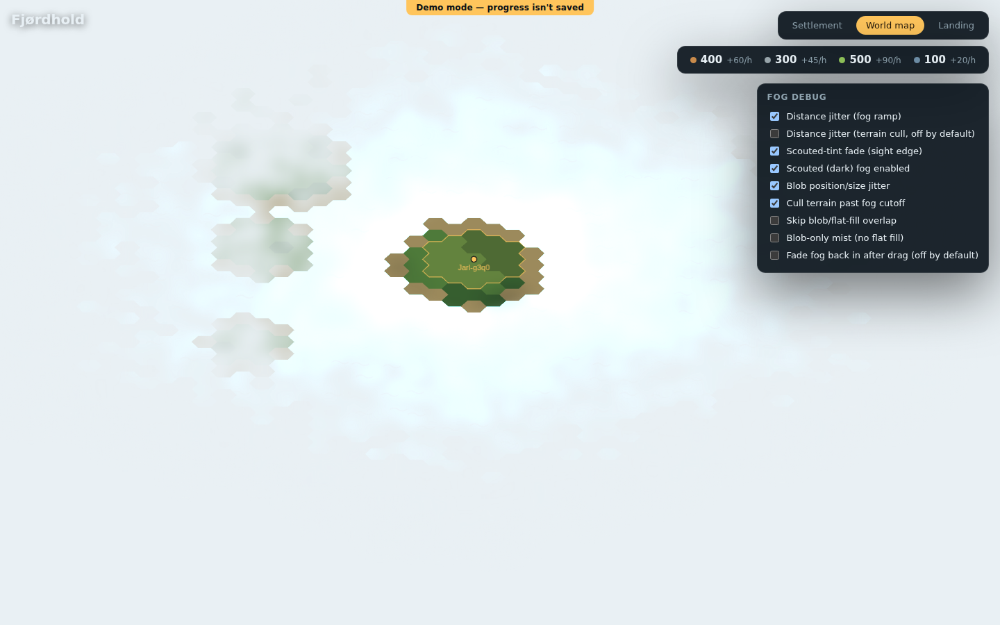
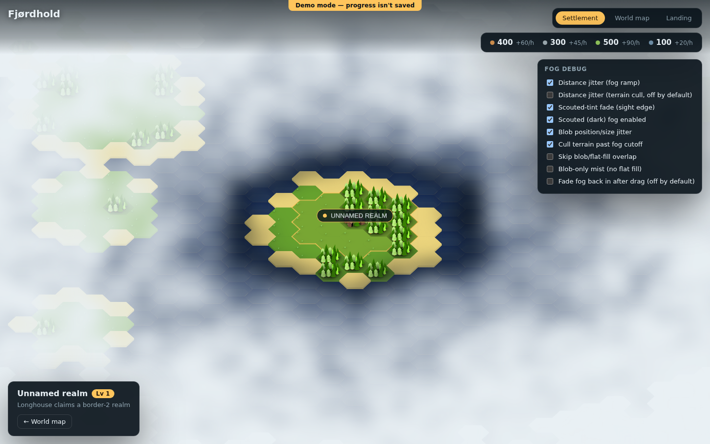
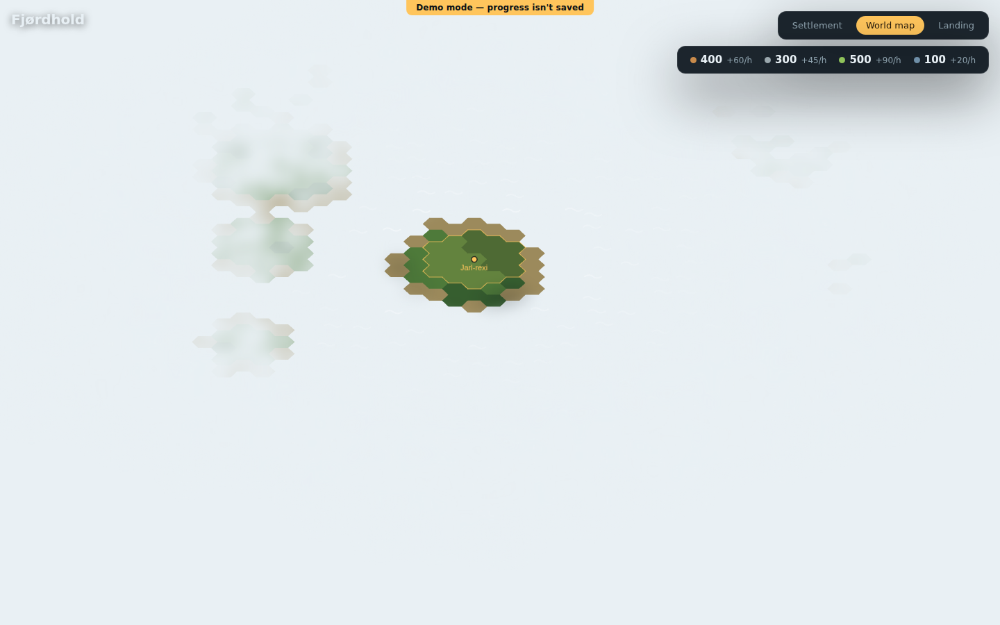
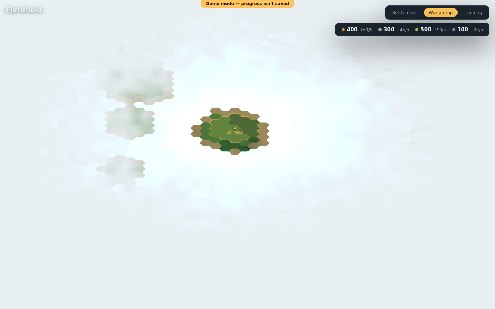
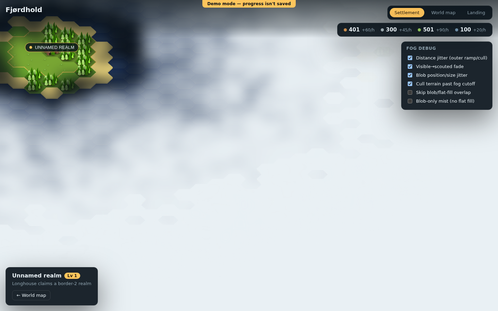
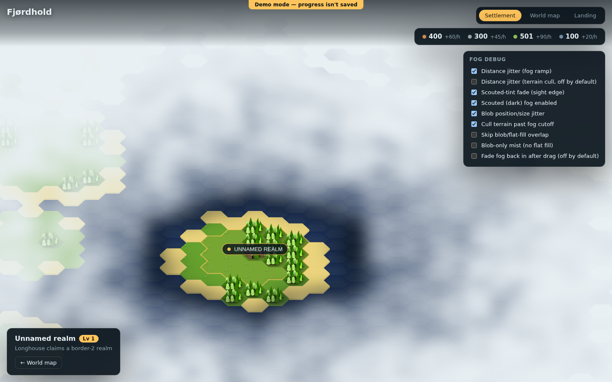
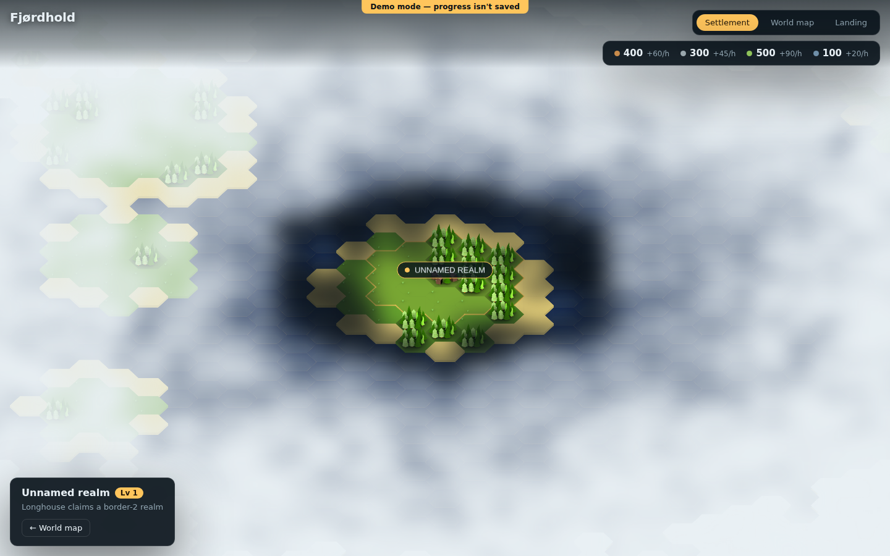
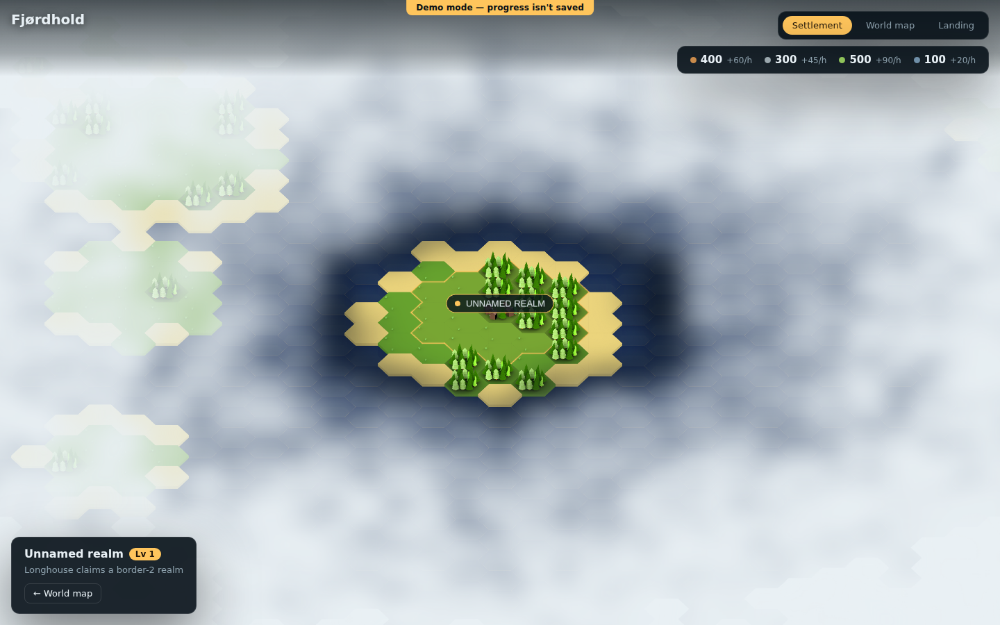

# Map & fog-of-war rendering — problems, fixes, and performance

Follow-up to [issue #20](https://github.com/VanDooProject/bjarnoy/issues/20), which reported six distinct fog-of-war bugs across the settlement view and world map and asked for a design doc covering: what was wrong, why, what was changed, screenshots, a review of whether each fix actually holds up, and the performance cost of every fog-rendering mechanism.

All six problems live in one file, [`src/frontend/src/lib/map/HexMapRenderer.ts`](../../src/frontend/src/lib/map/HexMapRenderer.ts) — the single PixiJS renderer shared by the settlement view and the world map (see that file's own module comment for why). This doc assumes a passing familiarity with that renderer's shape (sprite pools, the blurred fog-blob cache, the flat guaranteed-opaque fallback) rather than re-deriving it — the inline comments next to each constant are the primary source of truth; this doc is the narrative around *why each thing needed to change*.

## How to read this doc

Each problem below follows the same shape:

- **Reported** — the exact line from issue #20.
- **Root cause** — what the code actually did, with file:line references.
- **Fix** — what changed and why that's the right shape for the fix.
- **Screenshots** — before/after, or a debug-panel view where a static screenshot can't show the bug (e.g. draw-order races).
- **Review** — a second pass asking "is this actually correct?", including several cases (sections 2 and 4) where the first version of a fix was wrong — one a reactivity bug, one a visual regression, one a performance regression — and had to be corrected before it shipped.
- **Performance** — the cost of the mechanism involved, before and after, with real measurements where they exist and clearly-labelled reasoning where they don't.

All screenshots were taken with Playwright against the demo-mode build (`VITE_DEMO_MODE` default), seed 1, so the terrain/settlement layout is reproducible.

---

## 1. Scouted (dark) fog not reliably rendered underneath unexplored (white) fog

**Reported:** "dark/black scouted fog is not rendered underneath white fog"

### Root cause

Every fogged hex — whether unexplored (white, `FOG_UNEXPLORED`) or scouted-but-out-of-sight (dark, `FOG_SCOUTED`) — is drawn as one oversized, blurred "blob" sprite (`FOG_BLOB_W_SCALE`/`FOG_BLOB_H_SCALE` are 1.68×/2.7× the hex's own size) so neighbouring blobs overlap into a continuous cloud instead of a tiled hex pattern. That overlap is deliberate — it's what makes the mist read as organic rather than a hex-stamped grid — but it means a scouted-dark hex's blob routinely spills into, and gets spilled into by, its unexplored-white neighbours.

Pixi draws sprites within a container in child order, and `syncFogBlobs` (the pooled-sprite sync for the blob layer) never assigned a `zIndex` and never called `sortChildren()` — unlike the terrain sprite layers' own `syncSpriteLayer`, which does both. `rebuildBordersAndFog`'s per-hex loop populates the blob map by iterating `visibleCoords()`, which walks the viewport in a fixed column-then-row raster order — a purely geometric scan with no relationship to fog tier. So whichever blob (scouted or unexplored) happened to be visited later in that raster scan for a given screen region ended up drawn on top, regardless of which one was semantically supposed to sit "underneath."

Practically: near a settlement's scouted ring, on one side of the settlement the dark tint might correctly show through a neighbouring pale blob's translucent edge, while on the geometrically-opposite side (same distances, same alpha math, just visited earlier in the raster scan) the pale blob could end up on top, muting or hiding the dark tint. The bug is real but camera-position-dependent — a given static view is internally consistent (deterministic for that camera position), which is exactly why it read as "sometimes it works, sometimes it doesn't" rather than a clean reproducible screenshot.

### Fix

[`HexMapRenderer.ts`](../../src/frontend/src/lib/map/HexMapRenderer.ts) — added `FOG_BLOB_Z_SCOUTED`/`FOG_BLOB_Z_UNEXPLORED`, tagged every blob entry with a `z` derived from its tint, and made `syncFogBlobs` set `sprite.zIndex` and call `layer.container.sortChildren()` — the same pattern the terrain layer already used. Unexplored now deterministically draws above scouted, on every rebuild, regardless of raster-scan order: the "outer, denser unknown" always sits on top of the "you've been here, it's just out of sight" tint, everywhere.

### Review

This one is hard to prove with a single before/after screenshot: the bug's whole nature is that it's *not* wrong in any one fixed view, only inconsistent across views/positions. The fix is provable by construction instead — it now uses exactly the same "assign a stable per-entity zIndex, then sortChildren()" pattern the terrain sprite layer (`syncSpriteLayer`) already relied on, which is the established, working solution to the identical class of problem (deterministic stacking of pooled sprites populated in raster order) elsewhere in the same file. A rigorous visual proof would mean rendering the same final camera position via two different pan paths and diffing pixels — worth doing if this regresses again, out of scope for this pass.

### Performance

Free. `zIndex` assignment is one integer write per blob (same cost class as the existing tint/alpha/position writes), and `sortChildren()` is a single sort over the blob layer's children — bounded by how many blobs are on screen at once, which is itself bounded (blobs only exist within `FOG_MARGIN_HEXES` of the scouted ring plus `FOG_BLOB_OVERLAP_HEXES` of overlap headroom — see problem 4's performance section for why that count never scales with pan distance). No new allocations, no new draw calls.

---

## 2. `?debug=1` not persisted across navigation, and missing from the world map entirely

**Reported:** "`?debug=1` it not stored for browser session and also does not work in world map"

### Root cause

`FogDebugPanel` (the toggle panel for `fogDebugFlags`) was mounted only from `SettlementView.vue`, gated on a local `computed(() => route.query.debug === '1')`. Two separate bugs followed:

1. `WorldMapView.vue` never checked the query param and never mounted the panel — there was no way to see or flip a fog flag while looking at the world map, even though every flag it controls also gates world-mode rendering (`rebuildTerrainFlat`, `rebuildBordersAndFog` both read `fogDebugFlags` regardless of mode).
2. Every internal navigation (`HudNav`'s `router.push('/settlement')`, `router.push('/world')`, …) goes to a bare path with no query string. `?debug=1` was silently dropped the instant you clicked to another view — "debug mode" didn't survive a single click.

### Fix

Added [`useFogDebug.ts`](../../src/frontend/src/composables/useFogDebug.ts), a small shared composable: on `?debug=1` it writes a flag into `sessionStorage` (tab-scoped, cleared on close — this is a throwaway inspection aid, not a setting worth persisting across visits); `?debug=0` is the escape hatch back out, since there's no UI control to turn the panel off once shown. Both `SettlementView.vue` and `WorldMapView.vue` now call the same composable and mount `FogDebugPanel`. `WorldMapCanvas.vue` needed the same `defineExpose({ renderer })` `SettlementCanvas.vue` already had, so the panel's `forceRebuild()` call after flipping a flag has a renderer to call it on.

### Review

The first version of this fix read `route.query.debug` once, at `setup()` time, and returned a plain `ref`. That's wrong for one specific case: Vue Router reuses the current view's component instance (no remount, no fresh `setup()` run) when only the query string changes on the same route — which is exactly how the existing screenshot helpers (`scripts/screenshot-helpers/flow.mjs`, and this doc's own screenshot script) flip debug mode on an already-mounted view, via `history.replaceState` + a `popstate` dispatch. Testing against that exact scenario caught it immediately: the panel didn't appear. Fixed by watching `route.query` reactively (`watchEffect`) instead of reading it once — see the composable's own comment for the full reasoning. Caught before the first commit of this fix, not after.

### Performance

Negligible. One `sessionStorage` read/write on navigation, one reactive `watchEffect` per mounted view (settlement or world, never both). `FogDebugPanel` itself is six-to-eight checkboxes, rendered only when the flag is on.

**Before / after — world map, `?debug=1`:**

---

## 3. Distance jitter affecting terrain tiles, not just fog

**Reported:** "'distance jitter (outer ramp/cull)' affects tiles too (should not by default) -> add a sub list with the different elements it affects so I can toggle them"

### Root cause

`jitterDistance()` nudges a hex's raw distance by up to `±FOG_DIST_JITTER_HEXES` (2.5 hexes) before any fog-tier boundary is compared against it — this is what breaks a hex-distance ring's dead-straight facets into an organic mist edge (see that function and `FOG_DIST_JITTER_HEXES`'s own comments for the full reasoning, borrowed from the original mockup's own `fogAt()`). The same jittered value, from the same `fogDebugFlags.distJitter` flag, was used for **two** different things: the fog ramp's own alpha/blob-vs-flat-fill boundary (cosmetic — an organic mist edge is the goal), *and* the terrain-sprite draw cutoff in `rebuildTerrain`/`rebuildTerrainFlat` (functional — decides whether a tile's art is drawn at all).

Jittering the fog's edge is invisible-by-design (blurred, semi-transparent, overlapping blobs — an irregular edge reads as atmospheric). Jittering the terrain cutoff is not: it's a hard-edged tile-art sprite that either exists or doesn't, so a ±2.5-hex-jittered cutoff makes individual tiles pop in and out unpredictably as the camera crosses the ring — an obvious visual artifact on exactly the content that can't hide it.

### Fix

Split the single flag into `distJitter` (fog ramp only, default **on**) and `terrainCullJitter` (terrain cutoff, default **off**). With `terrainCullJitter` off, terrain instead culls at a fixed, unjittered distance padded by the fog ramp's own worst-case jitter: `FOG_TERRAIN_CULL_HEXES + FOG_DIST_JITTER_HEXES` (see `isPastTerrainCull`'s doc comment). That padding is the load-bearing detail — the original code jittered *both* cutoffs with the *same* per-hex value specifically so they'd always agree and never reopen the terrain/fog seam a previous fix (visible in the git history's `FOG_TERRAIN_CULL_HEXES` comment) had closed. Simply turning off jitter on the terrain side alone, without the padding, would have let the fog ramp's own (still-jittered) edge occasionally extend past an unjittered terrain cutoff, showing bare unfogged terrain in the gap. Padding by the fog ramp's worst case closes that gap unconditionally, so terrain is guaranteed to stop before the fog above it could ever be less than opaque, regardless of how the fog side jitters.

### Review

The one thing worth being honest about: with `terrainCullJitter` off, terrain now stops slightly *earlier* than before in the jittered direction (by up to `FOG_DIST_JITTER_HEXES`, worst case) — a small number of tiles right at the ring that would previously have drawn (because their individual jitter happened to extend the cutoff) now don't. Given they were being covered by opaque fog either way (fog and terrain always used the same threshold), this is not a visible regression — the padding is chosen as fog's own worst case specifically so it can't ever be. It's a few tiles' worth of terrain generation this fix intentionally trades away, in exchange for zero jittered pop-in.

### Performance

Slightly *cheaper*, not more expensive: the fixed-cutoff path (`terrainCullJitter` off, the default) skips the per-hex `hash01()` jitter computation entirely for every terrain-cull check, replacing it with a plain arithmetic comparison. The debug-only `terrainCullJitter: true` path reproduces the original per-hex jitter cost for comparison.

**Before / after — settlement view, panned to the ring edge (debug panel showing the split flags):**

---

## 4. World map: fog rendered as thousands of per-hex elements over open sea

**Reported:** "it seems white fog is rendered as/on tiles on worldmap -> I guess that's many elements and not a few white plains -> slow"

### Root cause

World mode never draws a terrain sprite for open sea at any distance (`rebuildTerrainFlat` skips `terrain === 'sea'` unconditionally — open water is meant to be a plain painted CSS backdrop, per that method's own comment). But the fog layer had no equivalent awareness: `rebuildBordersAndFog`'s per-hex loop drew a `Graphics.poly().fill()` for **every** unexplored hex in the viewport, land or sea, all the way out — plus, within `FOG_BLOB_OVERLAP_HEXES` of the ring, an additional blurred blob sprite per hex.

At `WORLD_DEFAULT_ZOOM` (0.22), a full viewport-plus-margin can be thousands of hexes, and the world map is mostly open ocean at that zoom — so the overwhelming majority of those per-hex fills were tessellating and filling a hexagon whose only job was "paint flat, fully-opaque `FOG_UNEXPLORED`, with nothing else drawn under or over it, ever." That's exactly what a canvas clear colour already does, for free, with zero per-hex work.

### Fix

Added `isEntirelyDeepFog(rect)`: before the main per-hex loop runs, a cheap check confirms whether *every* currently-visible hex is past `FOG_WORLD_BG_HANDOFF_HEXES` (the same distance the blob-overlap ring already stops at). If so, `syncWorldBackground` paints the PixiJS renderer's own clear colour solid `FOG_UNEXPLORED`, and `rebuildBordersAndFog` skips its entire per-hex fog loop for that rebuild — one flat colour instead of thousands of individual polygon fills.

**This is gated on the *whole* viewport, not decided hex-by-hex, and that distinction is load-bearing — see Review below.**

### Review — two real problems, both caught before merge

This fix went through two rounds of "looks right, measure it anyway" before landing, each catching a different class of mistake.

**Round 1 — a correctness regression.** The first version set the background colour whenever fog was active in world mode at all, and separately skipped drawing individual hexes past the handoff distance, one hex at a time, inside the main loop. That looked equivalent to the whole-viewport version, and it is *not*: a single canvas-wide background colour can't be region-specific. Sea tiles never draw anything of their own even once explored (same as unexplored — `rebuildTerrainFlat` skips sea unconditionally either way), so a currently-visible settlement's own nearby explored, clear open water was — under the per-hex version — indistinguishable from deep fog by any per-hex draw call, and the background paint covered it too. The result: a settlement's blue sea halo, which should show through the transparent canvas onto the CSS gradient backdrop, went solid fog-white right along with the genuinely deep hexes around it.

This was caught by screenshotting the default world-map view (settlement + its immediate surroundings, not a far pan) immediately after writing the first version, specifically *because* that view mixes near and deep content in one viewport — a far-pan-only screenshot would not have shown it. The fix: gate the whole optimisation on `isEntirelyDeepFog` confirming nothing in the *entire* current viewport could possibly need to stay transparent, and fall back to drawing every hex exactly as before otherwise.

**Round 2 — a performance regression, in the fix for round 1.** `isEntirelyDeepFog`'s first implementation scanned every hex in `coords`, bailing out at the first explored one it found, in raster (column-major) order — cheap-looking (no geometry, just lookups) but wrong: raster order has no relationship to distance from a settlement, so for a *mixed* viewport (a settlement's own default world-map view — not a deep-ocean pan) the settlement's explored area is a small fraction of what a low-zoom viewport covers, and the scan could walk a large fraction of its thousands of hexes before reaching the one explored hex that lets it return `false`. Paid on every rebuild, for exactly the common "looking at your own island" case the optimisation was never supposed to touch.

This was caught by re-running the same before/after benchmark used to justify round 1's numbers, rather than trusting a single favourable (deep-ocean-only) measurement: the mixed/near-settlement scenario came back **~1.7× slower** than before this fix existed at all — reproduced across three separate runs with different orderings, ruling out measurement noise as the explanation. Fixed by replacing the per-hex scan with a bounding check against settlement *positions* (`O(settlements)`, not `O(hexes in viewport)`): does any settlement's fog influence (`exploredRadius + FOG_WORLD_BG_HANDOFF_HEXES`, converted to world-space pixels, deliberately generous so it can only ever *under*-apply the optimisation) reach the current viewport's rectangle at all? See `isEntirelyDeepFog`'s own comment for the full reasoning.

Both rounds share a lesson: "this looks like the same thing, just implemented more simply" was wrong both times, in opposite directions (round 1 under-drew real content; round 2 over-paid for a shortcut) — and both were only caught by actually running the specific scenario each version was riskiest for, not by re-reading the diff.

**Before (broken round-1 version) / after (corrected) — default world-map view:**

**Deep-ocean pan, before and after (visually identical — this is the point):**

### Performance

Measured with a git worktree at the commit immediately before this fix, both dev servers warm, same seed, same Playwright-driven drag gesture (a real `mousedown`/`mousemove`/`mouseup` cycle, which triggers `HexMapRenderer.onPointerUp`'s synchronous `rebuildAll()`), median of 8 samples, after both rounds above landed:

| Scenario | Before this fix | After (final, bounding-check version) | Change |
|---|---|---|---|
| Deep ocean pan (viewport entirely unexplored, far from any settlement) | ~11.7s / 8 drags (median 1.46s/drag) | ~4.3s / 8 drags (median 0.54s/drag) | **~2.7× faster** |
| Default view (settlement + explored halo + some deep fog — mixed, not sped up) | ~8.8s / 8 drags (median 1.10s/drag) | ~8.7s / 8 drags (median 1.09s/drag) | unchanged (confirmed, not just "not measured as different") |

Caveats, stated plainly: these are wall-clock measurements inside a shared, resource-constrained container (two dev servers plus headless Chromium running concurrently), not a dedicated benchmarking environment, so absolute numbers are inflated relative to a real user's GPU-accelerated browser. Unlike the first draft of this section, though, the "default view" row here is no longer "noisy, presumed unchanged" — the round-2 regression above was real and reproducible (~1.7× slower, confirmed across three runs), and the final bounding-check version was re-measured *after* fixing it and lands back at parity with the pre-optimisation baseline, not just "within noise" of it.

The mechanism-level reasoning: the "before" cost for a deep-ocean rebuild is `O(hexes in viewport)` — thousands, at world-map zoom — each paying a `Graphics.poly()` tessellation and fill. The final "after" cost for *any* rebuild (deep or mixed) is `O(settlements)` for the bounding check, typically a handful — plus, for a mixed view, the unchanged `O(hexes in viewport)` drawing pass it always needed anyway. The deep-ocean case drops the expensive part (per-hex polygon tessellation) entirely; the mixed case pays only a handful of extra position comparisons on top of work it was always going to do.

---

## 5. Drag-release fade dims *all* fog, not just newly-revealed fog

**Reported:** "drag fades ALL elements in again, not only new; make fade disabled by default (since buggy); new elements should be rendered white and faded in if they are allowed to be seen anyway"

### Root cause

The blurred fog mist is rendered once per rebuild into a single offscreen `RenderTexture` (`fogBlobCacheTexture`) and displayed as one plain sprite (`fogBlobCacheSprite`) the rest of the time — see `refreshFogBlobCache`'s own extensive comment for why (a per-frame `BlurFilter` pass was enough to stall CI's software-rendered Chromium badly enough to time out `page.mouse.move`). While dragging, the blur is dropped entirely for responsiveness; on release, `onPointerUp` forced a fresh, correctly-blurred rebuild, then faded `fogBlobCacheSprite.alpha` from `FOG_DRAG_FADE_FROM_ALPHA` (0.25) back to 1 over `FOG_DRAG_FADE_MS` (350ms).

Because the entire mist is one shared bitmap, that alpha fade applies to **every** hex's fog in the same draw — fog the player had already been looking at, completely unchanged, dims and fades back in right along with whatever the drag actually revealed at the edge. There's no way to single out "just the new part" from a single flat sprite's alpha; the mechanism as built can't do what the fade was presumably meant to suggest (new fog rolling in) without also doing the wrong thing (old, already-settled fog flickering on every drag release).

### Fix

Added `fogDebugFlags.dragFade`, default **off**. `onPointerUp` now shows the freshly-rebuilt fog immediately at full alpha when the flag is off (the default) — no fade, no flicker. The flag (and the fade code itself) stays in place, gated, for anyone who wants to reproduce or iterate on the old behaviour; this is the same "keep the mechanism, gate it behind a debug flag defaulting to off" shape as the other fixes in this doc, rather than deleting working (if not currently *correct*) code outright.

The issue's second half — "new elements should be rendered white and faded in if they are allowed to be seen anyway" — describes a fundamentally different mechanism: fading only the hexes that are new to the viewport this rebuild, which requires diffing the blob set between rebuilds and animating a *subset* of a texture rather than one shared sprite's alpha (likely a second cache texture, or per-sprite alpha animation instead of the shared-bitmap approach). That's a real feature, not a bug fix, and is out of scope here; disabling the broken default (which the issue explicitly asks for — "make fade disabled by default") removes the visible bug today without committing to an unreviewed redesign of the cache in the same pass.

### Review

Straightforward: the fade either runs or it doesn't, and the flag is read at exactly one call site. The remaining honest gap is the one above — this closes the *reported* bug (all fog dimming) but does not implement the *suggested* improvement (only new fog fading in), which needs real design/architecture work beyond this pass.

### Performance

Strictly cheaper by default: one alpha assignment (`= 1`) instead of a `performance.now()` timestamp write plus a per-tick interpolation (`tickFogFade`, running every frame until the fade completes) for every drag release. No visible-quality cost — the fog was already fully rebuilt and correctly blurred by the forced `rebuildAll()` immediately before this point either way; the fade was purely a transition effect, not doing any work the correctness of the fog depended on.

**Before / after — immediately after a drag release:**

---

## 6. Visible→scouted jitter larger than its own margin, bleeding dark fog into the player's realm

**Reported:** "'visible -> scouted fade' has a strange name for what it does. and the effect jitters black fog into users realm, this is bad -> more view distance for player; also add a second toggle to disable black fog/scouted fog"

This report bundles three asks; each is addressed separately below.

### 6a. The jitter itself

**Root cause:** `jitterDistance()` is a shared helper used at every fog-tier boundary in the file, and — before this fix — always jittered by the same fixed amount, `FOG_DIST_JITTER_HEXES` (2.5 hexes), regardless of which boundary was calling it. That constant is sized against the *outer* unexplored ramp's own margin (`FOG_MARGIN_HEXES` = 10 hexes — a deliberate ~25% ratio, mirroring the original mockup's own noise-to-margin ratio; see that constant's comment). The visible→scouted ramp's margin (`FOG_VISIBLE_MARGIN_HEXES`) is only **2 hexes** — smaller than the jitter magnitude being applied to it. A jitter that can exceed its own ramp's width doesn't break up a ring facet (its intended job); it can push the *effective* boundary of "you can currently see this clearly" past where the settlement's actual line of sight ends, tinting ground dark that should read as fully, currently visible.

**Fix:** `jitterDistance()` now takes the jitter magnitude as a parameter instead of hardcoding `FOG_DIST_JITTER_HEXES`, and the visible→scouted ramp gets its own, proportionally-scaled constant: `FOG_VISIBLE_JITTER_HEXES = 0.5` — the same ~25–27% ratio against its own 2-hex margin that the outer ramp uses against its 10-hex one, instead of inheriting a value sized for a margin five times wider.

**Review:** This is a straightforward unit-scaling bug once named — "reuse the same noise constant everywhere" quietly assumed every ramp it was applied to had the same width, and only one of the two actually did. The fix is mechanical (parameterize, then size each call site's own value against its own margin) and easy to verify by construction: `0.5 < 2` in a way `2.5 < 2` never was.

### 6b. More view distance

**Root cause/ask:** the issue asks for more breathing room between "clearly visible" and where the scouted-tint ramp begins, on top of the jitter fix above — extra margin makes any *remaining* imprecision (this ramp's own width, rendering/camera rounding) far less likely to read as dark tint creeping onto the realm's own clear ground.

**Fix:** the settlement's/rival's line-of-sight radius (`visRadius`, used to compute `visibleEdgeDist`) is now `borderRadius + FOG_VISIBLE_RADIUS_BONUS_HEXES` with the bonus raised from 1 to 2 hexes.

**Review:** This one is a deliberate design knob, not a bug fix with a single right answer — "how much sight radius past the border" is a game-feel choice. One extra hex is a small, low-risk nudge in the direction the issue asked for; it isn't claimed to be the "correct" final value, just a direct response to "more view distance for player."

### 6c. Confusing flag name + missing full-disable toggle

**Fix:** `fogDebugFlags.visibleRamp` (the fade itself) is renamed to `scoutedTintFade` — it fades the *scouted tint*, not "visibility" itself, which was the issue's own complaint about the name. A new, independent `scoutedFog` flag (default **on**) turns the dark tint off *entirely*, for isolating whether a rendering artifact near a settlement's edge is the tint itself or its fade/jitter — the two flags compose (fade-off-but-tint-on reproduces the original hard binary jump; tint-off shows nothing at all past the border).

### Screenshots

**Before / after — settlement default view (the dark ring's proximity to the realm is the thing to compare):**

**Debug panel — renamed flag + new toggle:**

### Performance

Free. `jitterDistance` gained one function parameter (no new computation — the multiply already happened, it just uses a smaller/parameterized constant now). `scoutedFog` is a single boolean short-circuit around the same `addBlob` call that already existed — when off, it saves exactly the blob-add work for hexes in the scouted ring, a small, bounded set (`borderRadius + FOG_VISIBLE_RADIUS_BONUS_HEXES` in radius, not the whole viewport).

---

## Debug flags after this pass

`fogDebugFlags` (`HexMapRenderer.ts`), surfaced via `FogDebugPanel` on `?debug=1` in both the settlement view and the world map (fix 2):

| Flag | Default | What it isolates |
|---|---|---|
| `distJitter` | on | Distance jitter on the fog ramp's own alpha/blob-vs-flat-fill boundary — the mist's edge |
| `terrainCullJitter` | **off** (was implicitly on) | Whether the terrain-sprite draw cutoff jitters too, or uses a fixed, padded cutoff |
| `scoutedTintFade` | on | Renamed from `visibleRamp`. Fades the scouted (dark) tint in gradually vs. a hard binary jump |
| `scoutedFog` | **new**, on | Turns the scouted (dark) tint off entirely, independent of its fade |
| `unexploredFog` | **new**, on | Turns the unexplored (white) fog off entirely — both per-hex mist and the world-map deep-fog background shortcut — so only `scoutedFog`'s dark tint remains, for isolating the two fog tiers from each other |
| `blobJitter` | on | Per-hex position/size jitter on fog blobs |
| `terrainCull` | on | Whether terrain sprites stop being drawn past the fog cutoff at all |
| `flatFillOnly` | off | Skip the overlap blobs placed past the flat-fill cutoff |
| `blobsOnly` | off | Never switch to the flat, guaranteed-opaque fill — reproduces the original "fog never reaches full opacity" bug |
| `dragFade` | **off** (was implicitly on) | Whether releasing a drag fades the whole fog bitmap back in, or shows it immediately |

Three defaults changed in this pass (`terrainCullJitter`, `dragFade` off; `scoutedFog` added on) — all three were previously "always on, no way to turn off," and all three were the direct subject of an issue #20 complaint. `unexploredFog` was added afterward, on (matching prior always-on behaviour), as the white-fog counterpart to `scoutedFog`: with `scoutedFog` alone there was no way to isolate the *black* tier, since it renders overlapped with (and mostly hidden under) the white one near a settlement's edge — flipping `unexploredFog` off leaves only the dark, out-of-sight tint visible.

## Overall performance summary

The one mechanism with a real, measured performance win is problem 4 (world-map deep-fog background shortcut): **~2.7× faster** per drag-triggered rebuild when the viewport is entirely unexplored ocean, the scenario the issue's "many elements... slow" complaint was actually about — with the mixed/near-settlement case confirmed at parity, not just unmeasured. Every other fix in this doc is perf-neutral-to-slightly-cheaper by construction (a renamed/gated boolean, a parameterized constant, a `zIndex` write) — none of them add a new per-frame or per-rebuild cost; several remove one (fix 5's now-skipped fade tick, fix 3's now-skipped per-hex jitter hash on the terrain-cull path).

The renderer's existing architecture (documented in `HexMapRenderer.ts`'s own module comment) already does the heavy lifting that makes any of this tractable: pooled sprites batched by shared texture, a rebuild triggered only on real camera displacement past a threshold rather than every frame, and the fog blur baked into an offscreen cache rather than run as a live per-frame filter. This pass's fixes work within that shape rather than against it — the one new optimization (problem 4) follows the same "expensive work, cached / short-circuited whenever provably safe" pattern already used for the blur cache itself.
