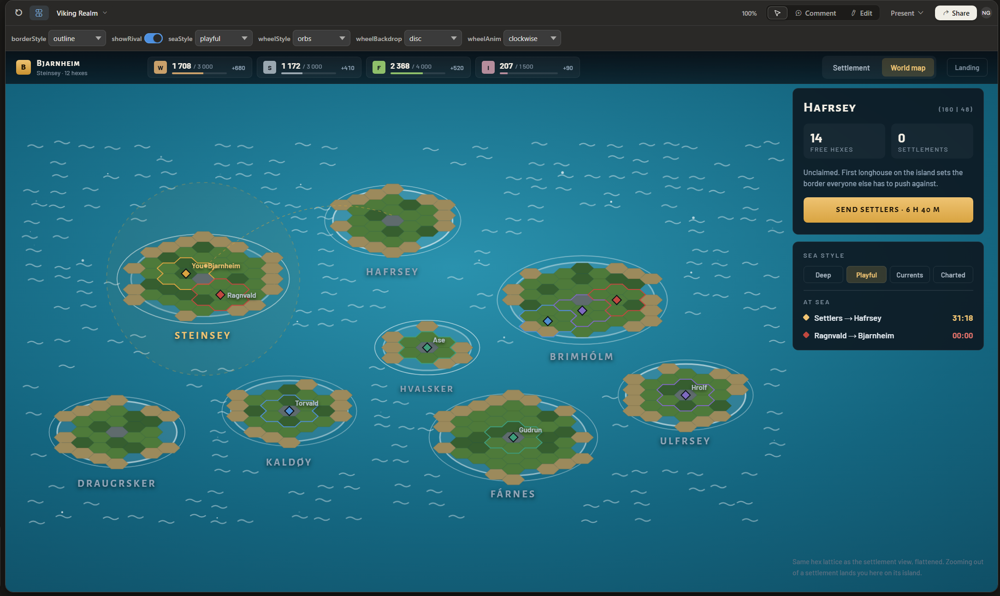
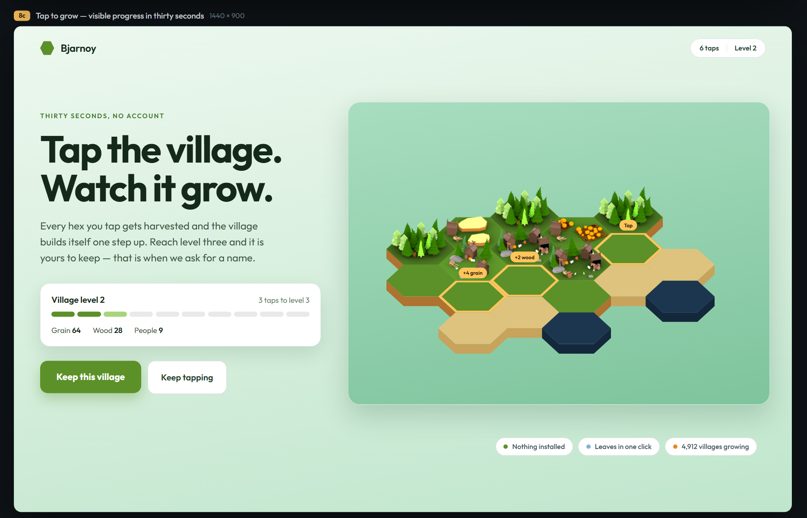
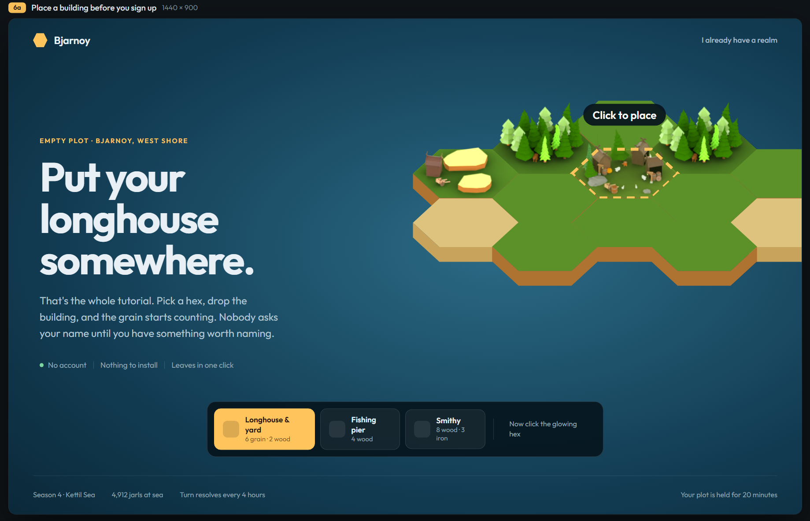
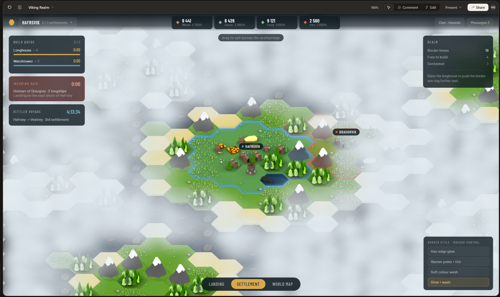

# Design brainstorms from Claude Design (zip files)

Three zip archives were attached to [issue #1](https://github.com/VanDooProject/bjarnoy/issues/1) by the project owner. They contain AI-generated UI mockups and design brainstorms for the game, each with its own README/notes.

> **Note:** The zip archives themselves are **not** in the repository (excluded via `.gitignore`). This document summarises the focus of each zip as described in the issue. The HTML prototypes are extracted from the zips and placed in `prototypes/` (filenames below).

---

## Zip 7 — World-map view

**File:** `Viking Browser Game UI (7).zip`
https://claude.ai/design/p/b32a5e69-7d7d-449c-a248-23de0551268e?file=Viking+Realm.dc.html

Focus: the **world map** — the high-level sea view showing islands, territories, and fleet movements. This is the "zoomed out" abstraction of the island/village view described in the game mechanics.

Key design concepts extracted:
- Islands rendered as small hexes (no images (yet)) on a sea background
- Territory shown as coloured outlines (per player/clan) (just the hex shapes, the circles around the islands should not be implemented)
- Fleet tracks visible on the map with ETAs
- Settlement indicators (icons/markers) on each island showing player presence
- waves move

can be found in: `prototypes\worldmap`

---

## Zip 4 — engaging Landing page concepts

https://claude.ai/design/p/e917b671-beea-4822-a33e-f067b0d199d3?file=Viking+Realm+UI.dc.html

Focus: **landing page / onboarding** — multiple pages and brainstorms for how to hook players directly into the game without a traditional registration wall.

Key design concepts extracted:
- World view is already on screen and moving when the page loads
- First interaction is a real game move (place a building, pick a plot, drop a wall)
- Account creation is deferred until the player has something worth naming or needs to interact with other players (so no attacks, messages, trades, etc. until they have an account)
- Multiple distinct page layouts / onboarding flows are included

Suggested prototype file: `prototypes\landing_pages`
**File:** `Viking village builder game (4).zip`

---

## Zip 9 — settlement/village view with Fog of war

https://claude.ai/design/p/48403e8e-e5ad-43fc-8e30-263bfa472034?file=Viking+Realm.dc.html

Focus: the **fog of war** mechanic and the **settlement / village view** — the zoomed-in view of a player's hex tiles, buildings, and contested borders. Here the player can interact with buildings, place new ones or take other actions.

Key design concepts extracted:
- Fog of war: unexplored hexes are hidden; scouted but not currently-visible hexes are greyed out (will be fetched from backend later on)
- Settlement view shows individual building sprites on hex tiles
- outline of realm with glow+wash

can be found in: `prototypes\village_view`
**File:** `Viking Browser Game UI (9).zip`

---

## Game mechanics extracted from the design files

The mechanics described in the README files inside the zips are consolidated in:

→ **`prototypes/MECHANICS.md`** (already in the repo)

That document covers: territory/borders (Settlers II style), settlements, colonisation, the unified map+village view, real-time resource rates, buildings, conflict, and onboarding philosophy.

