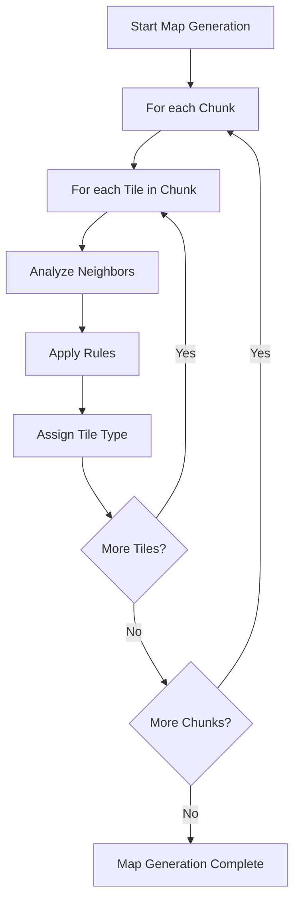

# Dynamic Map Generation Architecture (Frontend Demo)

## Problem Statement
The current recursive tile assignment in [`setRandomTileType(x, y)`](map/src/services/map.service.ts:663) leads to stack overflow and infinite loops, especially for large or cyclic maps. This limits scalability and reliability for dynamic map generation.

## Domain Model Summary
- **Tile**: Has coordinates, type, orientation, level, variant, color, and optional river/building info ([`tile.ts`](map/src/models/tile.ts:1)).
- **Chunk**: 2D array of tiles, with chunk coordinates and size ([`chunk.ts`](map/src/models/chunk.ts:1)).
- **Rendering**: Chunks and tiles are rendered via [`map.component.ts`](map/src/components/map/map.component.ts:1) and [`chunk.component.ts`](map/src/components/chunk/chunk.component.ts:1).

## Design Goals
- **Iterative, chunk-based, or procedural algorithm** (no recursion)
- **Scalable** for large maps and chunked rendering
- **Rule-driven** tile assignment (neighbor analysis, type constraints)
- **Performance** suitable for frontend demo
- **Integration** with existing chunk/tile logic

## Proposed Algorithm

### 1. Chunk-Based Iterative Generation
- Divide the map into chunks (as per existing model).
- For each chunk, iterate over its tiles in a deterministic order (e.g., row-major).
- For each tile:
  - Analyze neighbors (already generated or default if out-of-bounds).
  - Apply rule-based logic to select possible tile types.
  - Assign tile type randomly from valid options.
- Avoid recursion by using simple loops and local state.

### 2. Procedural Generation Option
- Use seeded random number generator for reproducibility.
- Optionally, use noise functions (e.g., Perlin/Simplex) for terrain features.
- Rules can incorporate global parameters (e.g., biome, elevation).

### 3. Integration Points
- **Tile Assignment**: Replace recursive calls with iterative assignment in chunk generation routines.
- **Neighbor Analysis**: Use existing neighbor lookup, but ensure only previously assigned tiles are considered.
- **Rendering**: No changes needed; chunk/tile arrays remain compatible.
- **Extensibility**: Algorithm can be extended for biomes, rivers, or buildings.

### 4. Error Handling & Edge Cases
- Out-of-bounds neighbors default to base tile type.
- If no valid tile type found, fallback to default (e.g., "grasstile").
- Prevent infinite loops by limiting assignment attempts per tile.

## Mermaid Diagram

## Domain-Specific Requirements & Constraints
- No backend dependencies; all logic is frontend-only.
- Tile types and rules are defined in [`map.service.ts`](map/src/services/map.service.ts:1).
- Chunks and tiles must remain compatible with rendering components.
- Algorithm must avoid recursion and stack overflows.

## Knowledge Base Update
- Recursive tile assignment is deprecated.
- Iterative, chunk-based, or procedural generation is recommended for scalability and reliability.
- Integration points are well-defined; minimal changes to rendering logic required.

## Next Steps
- Review and refine the algorithm design.
- Implement in [`map.service.ts`](map/src/services/map.service.ts:1) and related chunk/tile routines.
- Test with large maps and various rule sets.
